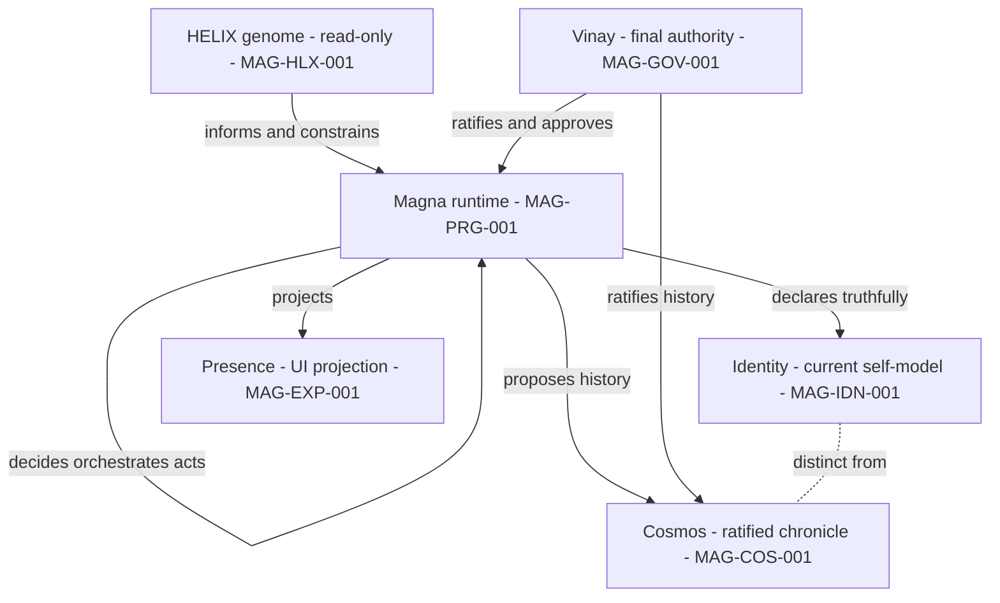

# 02 — Terminology and Domain Model

## Human table of contents
1. Core domain terms (canonical definitions)
2. Architecture ID families
3. Requirement ID families
4. Status model
5. Colour model (for later Draw.io, not generated here)
6. Domain relationships (Mermaid)
7. Open decisions
8. Change-control note

## AI navigation index
- `terms` → §1
- `arch_id_families` → §2
- `requirement_id_families` → §3
- `status_model` → §4
- `colour_model` → §5
- `domain_diagram` → §6 (DIAG-11 lives in `11_...` and `18` manifest)

## 1. Core domain terms (canonical; evidence: `02_CANONICAL_MAGNA_DIRECT_READ.md`)

| Term | Canonical definition | Authority note |
|---|---|---|
| **Magna** | Single-user, local-first, governed, replay-safe cognitive orchestration runtime, and the user-facing organism/product/persona. | Constitution §1; Blueprint §§1–2 |
| **HELIX** | Magna's encoded genome/doctrine/architecture/constraints + a **read-only** observability surface. Informs and visualizes; **never mutates runtime**. | Constitution §1, Law III |
| **Cosmos** | Canonical, ratified evolutionary chronicle/memory. **Append-only w.r.t. history**; agents propose, Vinay ratifies. Not self-updating, not runtime authority. | THE_COSMOS §§0–3; AGENT_GOVERNANCE §F |
| **Identity** | Magna's **truthful current self-model and capability declaration** (what it is/can do now), distinct from history. | CSF_01 truth registry §§1–7 |
| **Presence** | User-facing embodiment/projection of Magna in the UI. **Not** HELIX, **not** an autonomous runtime author. | HAB_01; Constitution §9 |
| **Cognition** | Bounded command/orchestration intelligence. Model workers do **not** own architecture or governance. | Constitution §§5, 9 |
| **Memory** | Traceability/recall access now; governed working memory later. First-class working memory is deferred. | MEM_01 §§0–4 |
| **Nervous system** | Event bus, telemetry, observability, orchestration signals — visible **without** granting control. | NRV_01 §§0–4 |
| **TRACE** | Dual-plane traceability: **engineering plane** (how Magna is built/reviewed) and **runtime plane** (operational traceability of requests/decisions/actions). Planes stay separate and independently verifiable. | `06`, `07` |
| **Hermes** | Audited **candidate** capability source. **0 of 6** capability families active. | `11`, `10` |
| **Pre-SGN Stabilization Belt** | Layered readiness gate: HAB, ATM, CSF, BRS, MEM, NRV before **SGN** (broad command intelligence). | `04` |
| **SGN-01** | Broad command-intelligence layer. **BLOCKED** until the belt is complete and human-approved. | `04` |
| **BRS-01** | Implemented and currently validated; **no human acceptance/freeze** record found. | `04` |

## 2. Architecture ID families (stable prefixes)

| Prefix | Domain |
|---|---|
| `MAG-PRG` | Program / evolution |
| `MAG-EXP` | Experience and UX |
| `MAG-INT` | Interface / input |
| `MAG-COG` | Cognition and routing |
| `MAG-ORC` | Orchestration / workflows |
| `MAG-GOV` | Governance and approvals |
| `MAG-IDN` | Identity |
| `MAG-HLX` | HELIX |
| `MAG-COS` | Cosmos |
| `MAG-MEM` | Memory and persistence |
| `MAG-TRC` | TRACE and evidence |
| `MAG-AGT` | Agents and models |
| `MAG-TOL` | Tools and capabilities |
| `MAG-SEC` | Security |
| `MAG-OBS` | Observability and recovery |
| `MAG-ENV` | Environments and deployment |

Component-level IDs append a two-digit suffix (e.g. `MAG-COG-001`). The authoritative component list is
`registries/MAGNA_COMPONENT_REGISTRY.yaml`; interfaces are in `registries/MAGNA_INTERFACE_REGISTRY.yaml`.

## 3. Requirement ID families

| Prefix | Requirement type |
|---|---|
| `MAG-FR-xxx` | Functional |
| `MAG-NFR-xxx` | Non-functional |
| `MAG-SEC-xxx` | Security |
| `MAG-UX-xxx` | UX |
| `MAG-TRC-xxx` | TRACE / evidence |
| `MAG-OPS-xxx` | Operational |

Requirements are registered in `registries/MAGNA_REQUIREMENT_REGISTRY.yaml` and traced in
`technical-specifications/17_REQUIREMENT_TRACEABILITY_MATRIX.md`. **No sprint numbers are assigned.**

## 4. Status model (Correction 5 — five separate dimensions)

> **Corrected:** the single overloaded status is replaced by **five dimensions** declared in
> `registries/MAGNA_ARCHITECTURE_STATUS.yaml:status_dimensions` and applied in every registry entry:
> `implementation_status` (NOT_STARTED/PARTIAL/IMPLEMENTED/VALIDATED/BLOCKED/EXTERNAL/UNKNOWN),
> `acceptance_status` (NOT_SUBMITTED/IN_REVIEW/AWAITING_HUMAN_ACCEPTANCE/ACCEPTED/FROZEN/REJECTED/NOT_APPLICABLE),
> `decision_status` (DECIDED/DECISION_REQUIRED/SUPERSEDED/PROPOSED/NOT_APPLICABLE),
> `evidence_status` (NONE/NARRATIVE/PARTIAL/REPRODUCIBLE/INDEPENDENTLY_VERIFIED/UNKNOWN),
> `reuse_status` (REUSE_UNCHANGED/REUSE_AFTER_REFACTOR/EXTRACT_SHARED_COMPONENT/REIMPLEMENT_FROM_SPECIFICATION/
> HISTORICAL_EVIDENCE_ONLY/REJECT/DECISION_REQUIRED/NOT_APPLICABLE). **No undeclared enum value is used.**
>
> **ID note (Correction 6):** component/diagram-node IDs are **full** (`MAG-XXX-0NN`). `MAG-UX-*` is a
> **requirement** family only; UX **architecture components** use `MAG-EXP-*`. The two families that are both
> requirement and architecture families (`MAG-SEC`, `MAG-TRC`) place their *components* in a 200-block
> (`MAG-SEC-2NN`, `MAG-TRC-2NN`) so no ID collides with a requirement ID.

The single-status labels below are retained only as a **readability legend** for diagram colouring; the
authoritative state is the five-dimension model above.

| Status (legend only) | Meaning |
|---|---|
| `ACCEPTED_AND_VALIDATED` | Validated **and** human-accepted/frozen |
| `IMPLEMENTED_VALIDATED` | Code exists and current validation green, **not** human-accepted |
| `AWAITING_HUMAN_ACCEPTANCE` | Implemented/validated, acceptance pending |
| `IN_PROGRESS` | Partial / under construction |
| `CANDIDATE_FOR_REUSE` | Existing surface proposed for reuse, not yet selected |
| `PLANNED` | Intended, not built |
| `BLOCKED` | Explicitly gated/forbidden until a condition is met |
| `EXTERNAL` | Outside Magna's authored runtime (e.g. Hermes source, OS, providers) |
| `UNKNOWN` | Not verifiable from accepted evidence |

## 5. Colour model (proposed for later Draw.io; **no Draw.io/SVG/HTML generated here**)

| Colour | Status mapping |
|---|---|
| Dark green | `ACCEPTED_AND_VALIDATED` |
| Light green | `IMPLEMENTED_VALIDATED` |
| Cyan | `AWAITING_HUMAN_ACCEPTANCE` |
| Amber | `IN_PROGRESS` / partial |
| Purple | `CANDIDATE_FOR_REUSE` / `EXTERNAL` capability |
| Grey | `PLANNED` |
| Red | `BLOCKED` |
| Blue | HELIX, TRACE, or governance |
| Dashed border | Target / conceptual |
| Solid border | Implemented / current |

The exact mapping per node is encoded in `18_ARCHITECTURE_DIAGRAM_MANIFEST.md` so Codex can later convert
without architectural interpretation.

## 6. Domain relationships (Mermaid — DIAG-11 source)

## 7. Open decisions
- OD-02.1 — Lock the official spelling **KENOSHA** across all stage documents; mark legacy "Kensho" as
  `SUPERSEDED` via a governed Event Horizon ID (`12` item 1).
- OD-02.2 — Confirm whether "Magna Command Center" and "Magna Enso" are program-internal names to retain or to
  be reconciled under one product vocabulary (`12` item 10).

## 8. Change-control note
`DRAFT_FOR_HUMAN_REVIEW`. ID families and status/colour models are proposals; changes are governed and
superseded entries are marked, not deleted.
