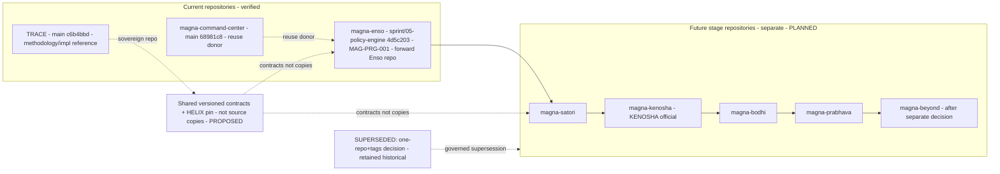

# 04 — Evolution and Repository Architecture (corrected)

> **Correction 1 & 3.** `magna-enso` **is** the Enso stage repository (continue it; do **not** create a
> replacement). Future stages are **separate repositories**. This **supersedes** the historical "one repo +
> tags" decision and the "Kensho" spelling — both retained as historical evidence, marked `SUPERSEDED`.

## Human table of contents
1. Official stage sequence (KENOSHA official; Kensho superseded)
2. Repository model — separate repo per stage (supersedes one-repo)
3. The supersession record (never deleted)
4. Repository & versioning diagram (DIAG-03)
5. Open decisions
6. Change-control note

## AI navigation index
- `stages` → §1 (MAG-PRG-001) · `repo_model` → §2 · `supersession` → §3 · `diagram` → §4 (DIAG-03)

## 1. Official stage sequence
**Enso → Satori → KENOSHA → Bodhi → Prabhava → Beyond** (human decision 6; spelling KENOSHA per decision 5).
- Conceptual meanings (from approved roadmap, preserved — see `16` for the two-column detail): Enso = circle
  of potential; Satori = first awakening; **Kensho/KENOSHA = seeing true nature**; Bodhi = mature awakening;
  Prabhava = source/manifestation; Beyond = continuous evolution.
- **Spelling supersession:** roadmap/charter say **"Kensho"**; human decision 5 makes **"KENOSHA"** official.
  "Kensho — Seeing True Nature" is preserved as the conceptual meaning + historical spelling (`SUPERSEDED`).

## 2. Repository model — separate repository per stage (human decision 4)
- **Enso:** `magna-enso` (branch `sprint/05-policy-engine`, HEAD `4d5c203`) — the **current forward Enso
  repository**. The architecture/spec package is **integrated into it after review and explicit approval**
  (Correction 13), not used to spawn a new repo.
- **Future stages — separate repositories:** `magna-satori`, `magna-kenosha`, `magna-bodhi`, `magna-prabhava`,
  and a `magna-beyond` repo **only after a separate decision** (decision 4).
- **Command Center** (`magna-command-center`) is a **verified implementation and reuse donor** (decision 3) —
  not a stage repo and not obsolete.
- **Compatibility without duplication:** stages share **versioned contracts** (`MAGNA_INTERFACE_REGISTRY`) and
  a **HELIX pin** (`HELIX_VERSIONING_OPTIONS.md`), **not** a shared source tree ("no cognitive monolith").
- **Repository-creation gates apply only to FUTURE-stage repos**, never to a replacement Enso repo.

## 3. The supersession record (never deleted)
| ID | Historical (preserved) | Superseding (current) | Status | Needs |
|---|---|---|---|---|
| SUP-01 | "One product line = one repo; stages are tags/branches, not new repos" (`MAGNA_ENSO_FOLDER_AND_REPO_STRATEGY` §3/§8; roadmap §5; charter) | Separate repository per stage (decision 4) | `SUPERSEDED` | governed Event Horizon ID (ADR-R2) |
| SUP-02 | Third stage spelled "Kensho" | "KENOSHA" official (decision 5) | `SUPERSEDED` | same Event Horizon ID |

The historical documents remain valid evidence and are **not edited or deleted**; the supersession is recorded
here and in `registries/MAGNA_ARCHITECTURE_STATUS.yaml:superseded_decisions`, pending the governed entry.

## 4. Repository & versioning architecture (DIAG-03)

## 5. Open decisions
- OD-04.1 — Governed Event Horizon ID enacting SUP-01 + SUP-02 (ADR-R2).
- OD-04.2 — Timing of creating future-stage repos (separate per-stage decisions; not now).
- OD-04.3 — HELIX-pin mechanism for cross-stage compatibility (`HELIX_VERSIONING_OPTIONS.md`).

## 6. Change-control note
`DRAFT_FOR_HUMAN_REVIEW`. magna-enso is the forward Enso repo. Supersession recorded, nothing deleted.
