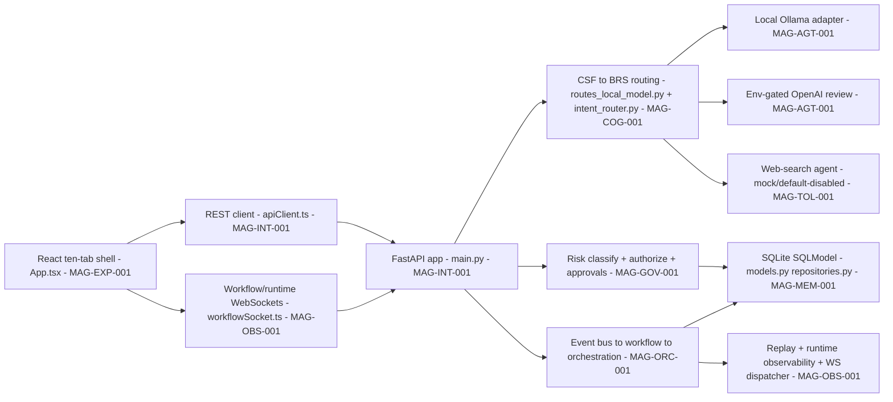
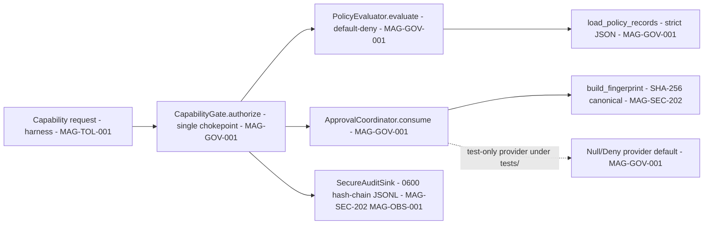

# 05 — Current Verified Architecture (CURRENT ONLY)

> This document describes **only what exists and validates today**. Nothing here is target architecture.
> Every claim traces to the accepted evidence baseline.

## Human table of contents
1. Magna Command Center — verified runtime (DIAG-04)
2. Magna Enso Sprint 5 — verified harness (DIAG-05)
3. TRACE — verified engineering template + Observatory
4. Verified validation results (the numbers)
5. Known drift and gaps (honest)
6. Open decisions
7. Change-control note

## AI navigation index
- `command_center` → §1 (DIAG-04)
- `enso_harness` → §2 (DIAG-05)
- `trace_current` → §3 (MAG-TRC-201)
- `validation_numbers` → §4
- `drift` → §5

## 1. Magna Command Center — verified runtime (DIAG-04) — `Status: IMPLEMENTED_VALIDATED`

Verified surfaces (evidence `03`): ten-route shell (Command, Identity, Agents, Memory, Explorer, Cognition,
Cosmos, Help, Settings, System); real REST/WebSocket; FastAPI routers (health, model/review, provider, policy,
authorization, approval, sessions/tasks, agent, system, WS, explorer, observability); event bus / workflow
engine / orchestration runtime / approval engine / runtime observability / WS dispatcher (executable classes,
durable reads/writes); SQLite persistence; local Ollama; env-gated OpenAI; default-mock web search; browser
voice; presence UI; engineering task prepare/close traceability scripts. **These are development capabilities,
not production certification.**

## 2. Magna Enso Sprint 5 — verified harness (DIAG-05) — `Status: IN_PROGRESS / IN_REVIEW (not accepted)`

Verified facts (evidence `05`, index): standard-library package, no runtime dependencies; default-deny on
missing policy/path/schema/provider/audit; SHA-256 invocation fingerprint binding (invocation, parameters,
resources, caller, policy, nonce, expiry), single-use; pending approvals memory-only, discarded on restart;
secure audit (`0600`, owner/regular-file checks, lock/fsync, sequence + SHA-256 chain) that **detects but
cannot prevent same-user tampering**; **49 unittest cases pass**; **standard pytest collection fails with 7
package-shadowing errors**; **no real runtime integration**, no authenticated human decision input, no durable
pending approvals, no exhaustive entry-point inventory. **It is a candidate, not a runtime engine.**

## 3. TRACE — verified engineering template + Observatory — `Status: IMPLEMENTED_VALIDATED (template)`
Evidence `06`: Claude-oriented repository template + local telemetry reference (instruction files, hooks,
JSONL→SQLite ingestion, FastAPI state/ROI/evidence/SSE endpoints, React Observatory, tests, CI). **Backend 6
tests pass; UI lint passes; local UI build is NOT reproducible** (missing installed `@rollup/rollup-darwin-arm64`).
`proposed-governed-loop/` is **proposed**, depends on external branch protection/secrets/apps, and **does not
count as TRACE today**. TRACE's **runtime plane is not delivered** — it is a target (`07`, `09 spec`).

## 4. Verified validation results (the numbers; evidence `10`, index)

| Target | Result |
|---|---|
| Command Center frontend build | PASS |
| Command Center backend pytest | 701 passed |
| Command Center router | 65 / 65 |
| Enso unittest | 49 passed |
| **Enso pytest collection** | **7 collection errors (broken)** |
| TRACE backend pytest | 6 passed |
| TRACE frontend lint | PASS |
| **TRACE frontend build** | **blocked (missing Rollup optional binary)** |

Status percentages (unweighted, **not** combinable): Pre-SGN accepted 50%; Enso accepted-sprint 26.7%; Enso
verified-runtime completion **0.0%**; architecture readiness 66.7%; UX 60%; environment 28.6%; release 25%;
Hermes active **0/6**.

## 5. Known drift and gaps (honest; evidence `02`, `06`, `08`)
- **CSF capability-truth drift:** registry says governed Ollama UI execution unavailable, while service/routes
  implement it — a later **governed** correction, not an audit edit.
- **Status drift in Enso:** `AGENTS.md`/`README.md`/`TRACE_CONFIG.yaml`/`STAR_MAP.md` disagree on sprint state;
  Sprint 5 source `IN_REVIEW` while tracker `PLANNED` by design (honest acceptance gating).
- **No production/UAT/DR** anywhere; bundle warning (1.85 MB JS); no comprehensive a11y/responsive/visual-regression evidence.

## 6. Open decisions
- OD-05.1 — Enso pytest package-layout correction + independent Sprint 5 security/acceptance review (`12` item 6).
- OD-05.2 — Disposition of the unaccepted Sprint 5 branch (keep vs quarantine) pending review (`13`).
- OD-05.3 — Governed correction of CSF Ollama capability-truth drift (`12` item 5).

## 7. Change-control note
`DRAFT_FOR_HUMAN_REVIEW`. Current-only; no target content. Changes are governed; superseded content marked.
