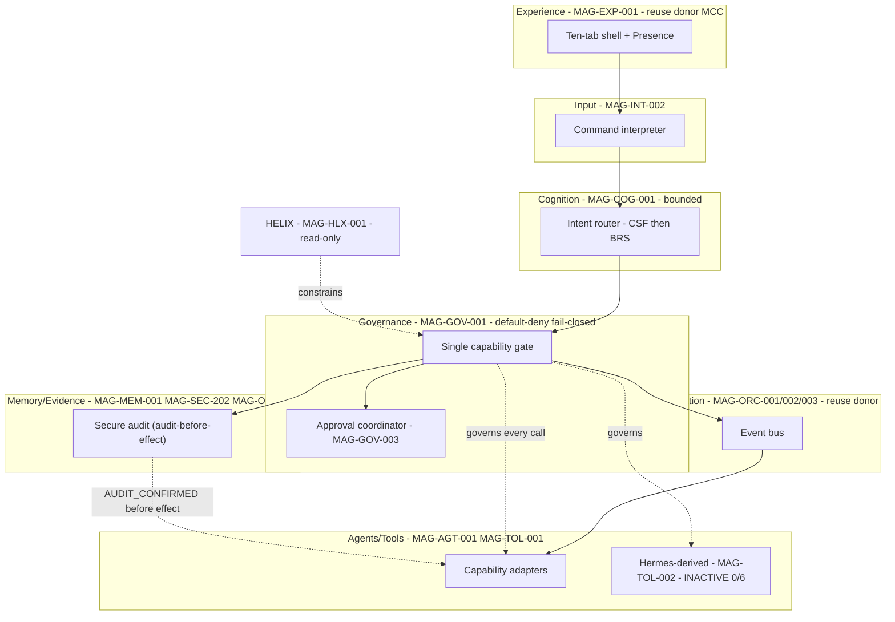

# 06 — Magna Enso Target Architecture (TARGET, corrected)

> **Correction 1.** The target Enso runtime is built **into the existing `magna-enso` repository** (branch
> `sprint/05-policy-engine`, HEAD `4d5c203`) — **not** a new clean repo. This architecture package is
> **integrated into `magna-enso` after review and explicit human approval** (Correction 13). Command Center
> is a reuse donor. Every component below is `PLANNED` / `CANDIDATE_FOR_REUSE` / `DECISION_REQUIRED` unless it
> cites a verified-current surface in `05`.

## Human table of contents
1. Target intent and non-goals
2. Target logical architecture (DIAG-06)
3. Layer-by-layer target responsibilities (full component IDs)
4. The composition question (compose vs select)
5. Integration & approval boundary (replaces "repo creation")
6. Open decisions
7. Change-control note

## AI navigation index
- `target_logical` → §2 (DIAG-06) · `layers` → §3 · `composition` → §4 (ADR-R1) · `integration` → §5

## 1. Target intent and non-goals
**Intent:** an Enso runtime (in `magna-enso`) that takes a command, routes it through bounded cognition,
governs every capability through **one default-deny, fail-closed chokepoint**, executes only permitted actions
**after a durable audit record is confirmed** (audit-before-effect, `18`), and emits durable, replay-safe,
independently verifiable evidence — HELIX read-only, Vinay final authority.
**Non-goals (Enso):** SGN-01 (BLOCKED); multi-user; public exposure; ambient voice; active Hermes (0/6);
autonomous working memory; self-certification. (Roadmap: Enso = zero autonomy by default.)

## 2. Target logical architecture (DIAG-06)

## 3. Layer-by-layer target responsibilities (full component IDs — Correction 6)

| Layer | Component ID | Responsibility | Reuse |
|---|---|---|---|
| Experience | MAG-EXP-001/002 | Frozen ten-tab shell + approval/recovery | REUSE_AFTER_REFACTOR (MCC) |
| Input | MAG-INT-002 | Command → structured intent; no privilege from payload | REIMPLEMENT |
| Cognition | MAG-COG-001 | Bounded routing (CSF→BRS) | REUSE_AFTER_REFACTOR (MCC) |
| Governance | MAG-GOV-001/002/003 | Single default-deny gate; policy; approval; fingerprint (MAG-SEC-201) | EXTRACT (Enso) / DECISION_REQUIRED (vs MCC MAG-GOV-004/005) |
| Orchestration | MAG-ORC-001/002/003 | Event bus, workflow, orchestration with lineage | REUSE_AFTER_REFACTOR (MCC) |
| Memory/Evidence | MAG-MEM-001/002, MAG-SEC-202, MAG-OBS-001 | Persistence + secure audit + replay; governed memory | compose — DECISION_REQUIRED |
| Agents/Tools | MAG-AGT-001/002, MAG-TOL-001 | Provider-neutral + capability adapters behind the gate | REUSE_AFTER_REFACTOR / REIMPLEMENT |
| Hermes | MAG-TOL-002 | EXTERNAL, inactive 0/6; only behind approved governance | HISTORICAL_EVIDENCE_ONLY |

## 4. The composition question (compose vs select) — ADR-R1
Does Enso **compose** Command Center's integrated primitives (MAG-ORC-001/MAG-GOV-004/005/MAG-OBS-001) with Enso's
strict policy controls (MAG-GOV-001/002/003, MAG-SEC-201/202), or **select one**? **This package does not
choose.** It requires the controlled experiment (`08`, spec `06`): one read-only, one local-write, one
external/approval-required capability through adapters for both engines.

## 5. Integration & approval boundary (replaces "repo creation" — Correction 13)
The clean-repo creation gate is removed. The relevant human decisions are instead:
1. **Existing Enso foundation-baseline approval** (accept current `magna-enso` state as the baseline).
2. **Architecture-package integration approval** (integrate this package into `magna-enso`).
3. **Backlog-preparation approval.**
4. **Sprint-planning approval.**
Passing one does **not** imply the next. No sprint numbers are assigned.

## 6. Open decisions
- OD-06.1 — ADR-R1 compose vs select.
- OD-06.2 — Whether existing Enso Sprint 5 components are extracted as the governance core or reimplemented.
- OD-06.3 — HELIX runtime boundary (`HELIX_VERSIONING_OPTIONS.md`).

## 7. Change-control note
`DRAFT_FOR_HUMAN_REVIEW`. Built into magna-enso (no new repo). Target/conceptual except where it cites `05`.
