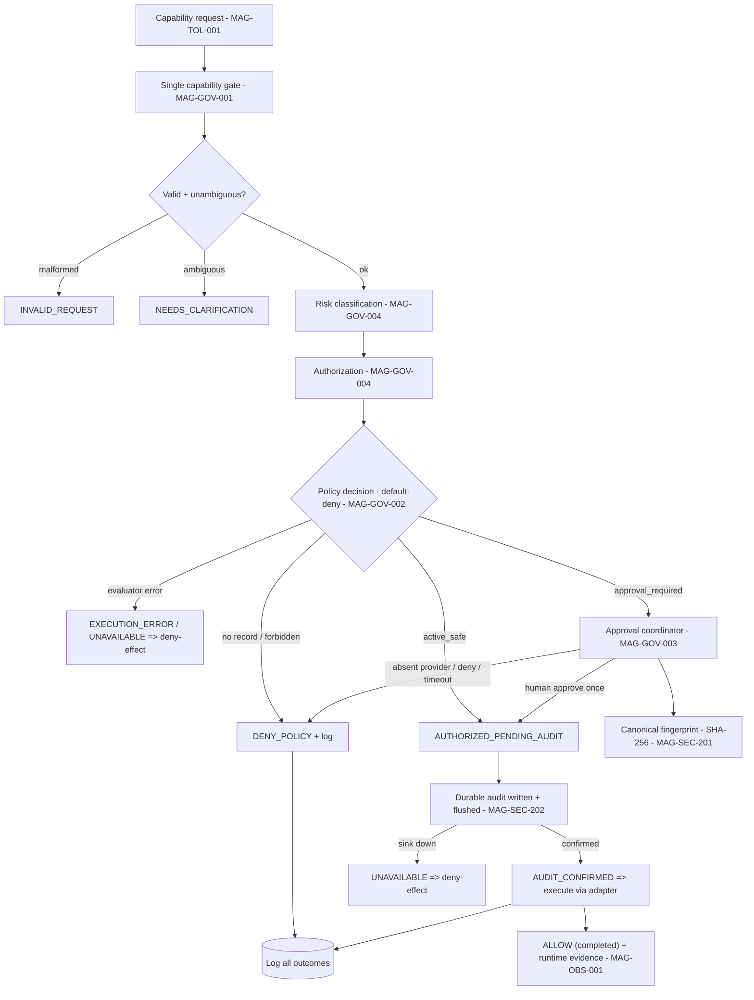

# 08 — Governance, Policy, and Approval

## Human table of contents
1. Governance principles (non-negotiable)
2. Policy / risk / authorization / approval flow (DIAG-10)
3. Default-deny and fail-closed
4. The policy-engine comparative experiment (no engine chosen)
5. Approval and human authority
6. Open decisions
7. Change-control note

## AI navigation index
- `principles` → §1 (MAG-GOV-001)
- `policy_flow` → §2 (DIAG-10)
- `default_deny` → §3
- `engine_experiment` → §4 (ADR-R1)
- `approval` → §5

## 1. Governance principles (non-negotiable)
Human final authority; **default-deny**; **fail-closed** consequential actions; no hidden autonomy; no
capability bypass; durable decision lineage; **no worker self-approval**; Magna must **not certify its own
output**. These are program invariants (`02`, `03`, evidence `04`/`05`).

## 2. Policy / risk / authorization / approval flow (DIAG-10)

> **Corrected (C9/C10):** outcomes use the **taxonomy** in `technical-specifications/19` (not "everything →
> DENY"); the effect order follows **audit-before-effect** in `technical-specifications/18` (an `ALLOW` alone
> never triggers an effect — a durable record must be `AUDIT_CONFIRMED` first).

Verified-current today: Command Center has risk classification, authorization context, durable approval
records and lifecycle (`05`). Enso harness adds canonical fingerprint binding + secure audit. **What is NOT
proven:** that **every** capability entry point passes through **one** canonical gate (`05` "missing
controls") — this is why **R-06 (policy bypass) stays OPEN** and the chokepoint claim is target, not current.

## 3. Default-deny and fail-closed
Any missing policy/path/schema/provider/audit, any evaluator error, any approval timeout ⇒ **DENY**. Never
"allow because empty/unavailable/timed-out/errored." Restart resting state = default-deny. (Verified at the
Enso harness boundary; **completeness for real runtime entry points is unproved** — target.)

## 4. The policy-engine comparative experiment (ADR-R1) — **no engine chosen**
Per `05`, **do not select a canonical engine yet.** Required experiment before any selection:
1. Define **one read-only**, **one local-write**, **one external/approval-required** capability contract.
2. Route each through **adapters for both engines** (Command Center integrated controls; Enso strict policy).
3. Test: parameter substitution, replay, restart, audit failure, **direct-entry bypass**, authorization identity.
4. Compare evidence and operational coupling.
5. **Vinay** decides compose / adapt / replace. (Full protocol in `technical-specifications/06_...`.)

## 5. Approval and human authority
- Only an **authenticated human owner** may turn `HOLD_FOR_APPROVAL` into `ALLOW` (production invariant).
- Enso ships a **test-only** provider; **production provider absent ⇒ DENY** (no silent allow).
- Approvals are **per-action, fingerprint-bound, single-use, expiring, revocable, fully logged**.
- `draft_only` persistence is itself an approval. Commit/push/merge are human-gated.

## 6. Open decisions
- OD-08.1 — ADR-R1 engine disposition after the experiment (`05`).
- OD-08.2 — Whether ATM advisory boundaries are hardened to enforced before Enso runtime (`04` ATM note).
- OD-08.3 — Authenticated `HumanDecisionProvider` design (identity/UI/channel) — a separate later sprint.

## 7. Change-control note
`DRAFT_FOR_HUMAN_REVIEW`. No policy engine selected. Changes governed; superseded content marked, not deleted.
