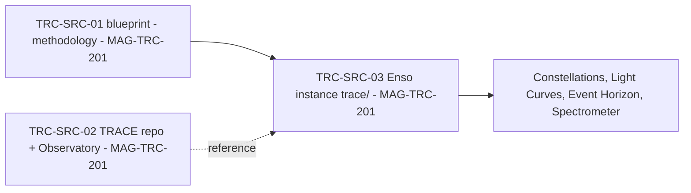
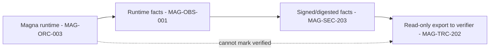
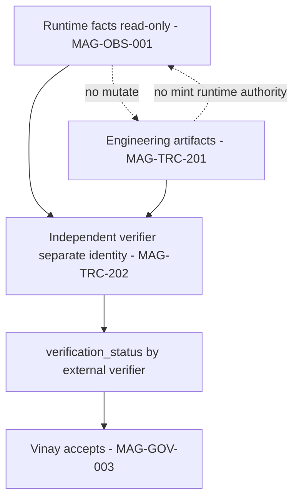

# 09 — TRACE Dual-Plane Architecture (corrected, Correction 2)

> **Canonical TRACE sources are now resolved** (see `TRACE_SOURCE_RESOLUTION.md`): **TRC-SRC-01** methodology
> blueprint (`…/Magna/trace/TRACE_STRATEGIC_BLUEPRINT_v1.0.md`, sha256 `9fff38ab…`), **TRC-SRC-02**
> implementation/reference repo (`<LOCAL_USER_HOME>/Projects/AI/TRACE`, `c6b4bbd`), **TRC-SRC-03** applied Enso
> instance (`magna-enso/trace/`). Ambiguous paths removed. **No TRACE effectiveness is claimed.**

## Human table of contents
1. The two planes (decision 6)
2. Canonical sources (resolved)
3. Engineering plane (DIAG-14)
4. Runtime plane (DIAG-15)
5. Cross-plane + anti-self-certification (DIAG-16)
6. Minimum cross-plane schema
7. Open decisions
8. Change-control note

## AI navigation index
- `two_planes` → §1 · `sources` → §2 · `engineering` → §3 (DIAG-14) · `runtime` → §4 (DIAG-15) · `xplane` → §5 (DIAG-16)

## 1. The two planes (human decision 6)
- **Engineering plane:** TRACE **governs how Magna Enso is engineered** (task packets/Constellations, Light
  Curves, Event Horizon decisions, Spectrometer validation). `implementation_status: PARTIAL`; **effectiveness
  NOT established** (`06`).
- **Runtime plane:** TRACE-**compatible operational traceability inside Magna** (requests/decisions/approvals/
  actions/failures/memory effects). `implementation_status: NOT_STARTED` (PLANNED).
- **Planes stay separate and independently verifiable; Magna must not self-certify.**

## 2. Canonical sources (resolved — TRACE_SOURCE_RESOLUTION.md)
| ID | Path | Role | Pin |
|---|---|---|---|
| TRC-SRC-01 | `…/Magna/trace/TRACE_STRATEGIC_BLUEPRINT_v1.0.md` | Methodology blueprint (source of truth) | sha256 `9fff38ab2147e614494bddc8e4098afe57b77502850d8bc00e27f4d3591755f2` |
| TRC-SRC-02 | `<LOCAL_USER_HOME>/Projects/AI/TRACE` | Implementation/reference repo + Observatory | git `c6b4bbd` (remote MightyM-ouse/trace) |
| TRC-SRC-03 | `magna-enso/trace/` | Applied Enso instance | config sha256 `e4408c70…` |

## 3. Engineering plane (DIAG-14) — partly current

Verified (`06`): template + telemetry + Observatory; backend 6 tests pass, lint passes; **UI build not
reproducible** (missing rollup binary). **Effectiveness (context efficiency, reproducible handoff, drift
prevention) NOT established.**

## 4. Runtime plane (DIAG-15) — TARGET

## 5. Cross-plane + anti-self-certification (DIAG-16) — TARGET

## 6. Minimum cross-plane schema (PROPOSED — MAG-TRC-003)
`trace_id, plane, event_id, task_id, correlation_id, causation_id, actor, source, occurred_at, artifact_uri,
content_digest, policy_version, privacy_class, replay_safe, verification_status, verified_by, verified_at`.
`verification_status` defaults `unverified`; **Magna cannot self-set `verified`.**

## 7. Open decisions
- OD-09.1 — Freeze TRC-SRC-01 @ that hash as the program TRACE reference (ADR-R3).
- OD-09.2 — Cross-plane contract + verifier identity + reproducibility standard (ADR-R3; `12` items 3,9).
- OD-09.3 — Fix TRACE UI build reproducibility (missing rollup binary).

## 8. Change-control note
`DRAFT_FOR_HUMAN_REVIEW`. Sources pinned; effectiveness not claimed; planes separate. Governed; nothing deleted.
