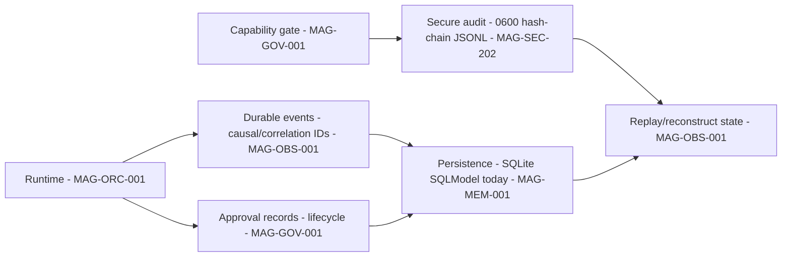
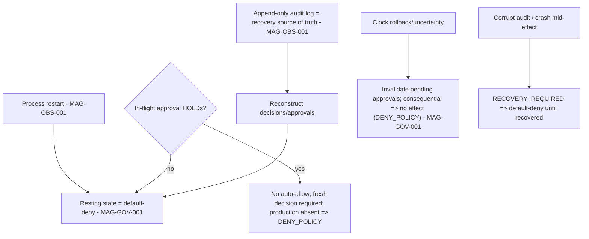

# 10 — Memory, Data, Evidence, and Replay

## Human table of contents
1. Memory model (governed; working memory deferred)
2. Persistence & evidence (DIAG-12)
3. Audit durability — append-only ≠ tamper-proof
4. Observability, replay, recovery, audit (DIAG-20)
5. Open decisions
6. Change-control note

## AI navigation index
- `memory_model` → §1 (MAG-MEM-001)
- `persistence_evidence` → §2 (DIAG-12)
- `audit_durability` → §3 (MAG-SEC-202 MAG-OBS-001)
- `replay_recovery` → §4 (DIAG-20)

## 1. Memory model (MAG-MEM-001) — `Status: traceability now; governed working memory PLANNED`
Per `02`: memory today = traceability/recall access; **first-class autonomous working memory is deferred**
(MEM-01 pending belt layer, `04`). Target memory is **governed**: writes that persist beyond a session require
approval (`draft_only` persistence is an approval); minimal necessary context; no silent retention.

## 2. Persistence & evidence (DIAG-12)

Verified-current (`03`,`05`): MCC SQLite persistence + durable event lineage + approval lifecycle + replay;
Enso secure hash-chained JSONL audit. Composition (MCC durability + Enso secure audit) is **target /
DECISION_REQUIRED** (`05`).

## 3. Audit durability — append-only ≠ tamper-proof (honest)
Enso's audit sink is **integrity-detecting, not tamper-proof**: `0600`, owner/regular-file/symlink checks,
lock + fsync, sequence + SHA-256 hash-chain. It **detects** alteration but **cannot prevent** a same-user
local administrator from editing files (and recomputing the chain) — a signed/external tamper-evident store is
**future work** (`05`). The package must never claim "tamper-proof" or "immutable."

## 4. Observability, replay, recovery, audit (DIAG-20)

> **Outcome note (C4):** recovery uses the taxonomy in `technical-specifications/19`. A **consequential** action
> on clock-rollback/absent-provider yields **no effect** (`DENY_POLICY` is the policy closure; a corrupt
> sink/crash yields `RECOVERY_REQUIRED`, an unavailable dependency `UNAVAILABLE`). Read-only recovery queries
> are not relabelled as policy denials.

Recovery facts (`05`): pending approvals memory-only, discarded on restart; expiry uses monotonic time
(resets on restart); clock rollback invalidates approvals ⇒ no effect (fail closed); wall-clock is **evidence only**, never expiry
authority; single-use fingerprint-bound approvals cannot be replayed after a crash; **no persistent "enabled"
runtime state** survives restart as an open door.

## 5. Open decisions
- OD-10.1 — Composition of MCC durable persistence with Enso secure audit (links ADR-R1).
- OD-10.2 — Governed working-memory scope (MEM-01 acceptance) (`04`, `12` item 4).
- OD-10.3 — Whether/when to adopt a signed/external tamper-evident audit store (future).

## 6. Change-control note
`DRAFT_FOR_HUMAN_REVIEW`. Audit is integrity-detecting, not tamper-proof. Changes governed; no deletion.
