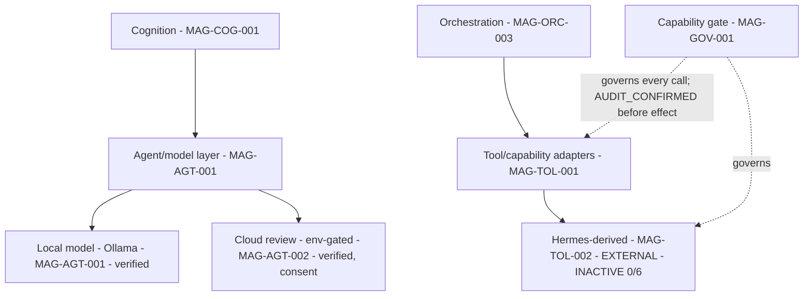

# 11 — Agents, Models, Tools, and Hermes (corrected)

## Human table of contents
1. Provider neutrality & worker replaceability
2. Agents/models/tools/adapters (DIAG-13, full IDs)
3. Hermes-derived boundary — four adoption layers (0/6 active)
4. Local/cloud consent
5. Open decisions
6. Change-control note

## AI navigation index
- `neutrality` → §1 (MAG-AGT-001) · `adapters` → §2 (DIAG-13) · `hermes` → §3 (MAG-TOL-002; HERMES_DERIVED_CAPABILITY_PLAN.md)

## 1. Provider neutrality & worker replaceability
Models/workers are replaceable behind adapters; no provider is load-bearing for architecture/governance.
Verified-current (`03`): local Ollama (MAG-AGT-001), env-gated OpenAI review (MAG-AGT-002), default-mock web
search. Workers propose/recommend; **none self-approves** (Galaxy Catalog; worker model).

## 2. Agents / models / tools / adapters (DIAG-13)

## 3. Hermes-derived boundary — four adoption layers (MAG-TOL-002, EXTERNAL) — **0/6 active**
Per `HERMES_DERIVED_CAPABILITY_PLAN.md`, separate: **(1) source-code adoption** (only a *planned* clean
governed fork baseline, Sprint 4; provenance+SHA+MIT); **(2) capability adoption** (PLANNED scope, none
active); **(3) Magna-owned reimplementation inspired by Hermes** (PROPOSED/DECISION_REQUIRED); **(4)
activation** (0/6; gated). The capability table (terminal, browser, messaging, agent, memory, tools +
scheduler report-only + LAN-only mobile) lives in that plan. **Selected governed capabilities may be PLANNED
for Enso without being active.** Current reuse value = provenance/license metadata only.

## 4. Local/cloud consent (MAG-SEC-203)
Local-first by default; any cloud/provider call is explicit, consent-gated, recorded with provider/model/config
digest + local/cloud class. Secrets never exported by default.

## 5. Open decisions
- OD-11.1 — Per-capability source strategy (governed fork vs reimplementation) — Sprint 2/3 outcomes.
- OD-11.2 — Activation gate + authenticated approval channel (future; human decision 8).
- OD-11.3 — Worker registry/role binding (TRACE Galaxy Catalog reuse).

## 6. Change-control note
`DRAFT_FOR_HUMAN_REVIEW`. Hermes 0/6 active. "PLANNED" ≠ active. Governed; nothing deleted.
