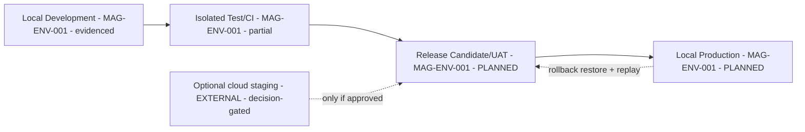

# 13 — Environment, Deployment, and Operations (corrected)

## Human table of contents
1. Single-user local-first principle
2. The four environments (MAG-OPS-001)
3. Environment/release architecture (DIAG-18)
4. Foundation & integration approval gates (Correction 13)
5. Current evidence
6. Open decisions
7. Change-control note

## AI navigation index
- `local_first` → §1 (MAG-ENV-001) · `environments` → §2 · `release` → §3 (DIAG-18) · `approval_gates` → §4

## 1. Single-user local-first principle
One user, locally, **without unnecessary cloud/SaaS**. Cloud staging/hosted remains **optional and
decision-gated** (ADR-R12). Charter posture: local-first, LAN-first, safe-by-default.

## 2. The four environments (MAG-ENV-001 / MAG-OPS-001) — target definitions

| Env | Purpose | Data isolation | Secrets | Provider | Network | Backup | Promotion | Rollback | Evidence |
|---|---|---|---|---|---|---|---|---|---|
| Local Development | Build/iterate | Dev DB/dirs | local `.env`, never in TRACE | local Ollama; cloud opt-in | loopback/LAN | dev snapshot | manual | discard branch | build + unit logs |
| Isolated Test/CI | Deterministic tests | ephemeral fixtures | none/mocked | mocked/local | none | none | gate on green | re-run | raw test output + digests |
| Release Candidate/UAT | Human acceptance | UAT copy | UAT-scoped | as prod-local | local | UAT snapshot | human sign-off | restore snapshot | signed acceptance + Light Curve |
| Local Production | Vinay's daily runtime | prod DB/dirs | prod-scoped local | local-first; cloud consented | local | scheduled backup | human-gated | restore + replay | release artifact + acceptance + backup proof |

## 3. Environment / release architecture (DIAG-18)

## 4. Foundation & integration approval gates (Correction 13)
**Replaces the "new Enso repository creation gate."** `magna-enso` already exists. The separate human
approvals are: **(1) existing Enso foundation-baseline approval → (2) architecture-package integration
approval → (3) backlog-preparation approval → (4) sprint-planning approval.** No sprint numbers, no
implementation, no engine selection, no Hermes activation, no BRS-01/Sprint-5 acceptance here. (Full text in
`17` §2.)

## 5. Current evidence (`08 ec`, `10 ec`)
Evidenced: Local/dev (strongest), Test (MCC + TRACE backend; Enso unittest; **Enso pytest broken**). Absent:
integration env, staging, UAT, production, DR. Environment readiness **2/7 (28.6%)**; release **3/12 (25%)**.
Branch model (charter/repo-strategy): `main` protected, `develop`, `sprint/NN-slug`; merges to `main` need a
human-reviewed review-package. **Tags are not releases.**

## 6. Open decisions
- OD-13.1 — Environment/release topology incl. DR (ADR-R9).
- OD-13.2 — Backup/restore + replay recovery standard for Local Production.
- OD-13.3 — Cloud staging (default: no; ADR-R12).

## 7. Change-control note
`DRAFT_FOR_HUMAN_REVIEW`. Repo-creation gate replaced by four approval gates. Governed; nothing deleted.
