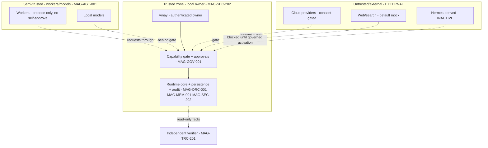

# 14 — Security, Privacy, and Trust Boundaries

## Human table of contents
1. Security principles
2. Security zones & trust boundaries (DIAG-19)
3. Secrets & privacy classes
4. Audit-file security (honest limits)
5. Open decisions
6. Change-control note

## AI navigation index
- `principles` → §1 (MAG-SEC-202)
- `zones` → §2 (DIAG-19)
- `secrets_privacy` → §3 (MAG-SEC-202)
- `audit_security` → §4 (MAG-SEC-202)

## 1. Security principles
Privacy-first defaults; default-deny; fail-closed; explicit local/cloud consent; minimal necessary context;
no secrets in TRACE/evidence; durable lineage; **integrity-detecting (not tamper-proof)** audit; independent
verification; no self-certification.

## 2. Security zones & trust boundaries (DIAG-19)

Trust decreases left/top→right/bottom; **every** boundary crossing into the trusted zone goes through the gate.

## 3. Secrets & privacy classes
- Secrets live in local `.env`/OS keychain scope; **never** ingested into TRACE/evidence (`07`).
- Provider calls record provider/model/config **digest** + local/cloud classification + consent reference;
  **never** raw secrets or full sensitive payloads by default.
- Audit redaction: store fingerprint/per-field **hashes**, not raw payloads, while preserving verification
  (`05`). Redaction must not weaken the binding.
- Privacy classes are carried in the cross-plane schema (`privacy_class`, `09`).

## 4. Audit-file security (honest limits — `05`)
`0600` owner-only; atomic restrictive creation (no permissive intermediate); owner-UID verification;
regular-file verification; symlink refusal; re-checked at startup **and before each use**. Any failure ⇒
initialization failure ⇒ **DENY-all**. **Limit:** detects but cannot prevent same-user tampering; a signed/
external tamper-evident store is future work. On non-POSIX platforms, apply closest owner-only ACL and
**document the gap**; if the secure property cannot be established, **fail closed**.

## 5. Open decisions
- OD-14.1 — Adoption of a signed/external tamper-evident audit store (future).
- OD-14.2 — Independent verifier identity/process and its read-only access model (`12` item 3).
- OD-14.3 — Cloud-data consent policy formalization (`13` gate 9).

## 6. Change-control note
`DRAFT_FOR_HUMAN_REVIEW`. Audit is integrity-detecting, not tamper-proof. Changes governed; no deletion.
