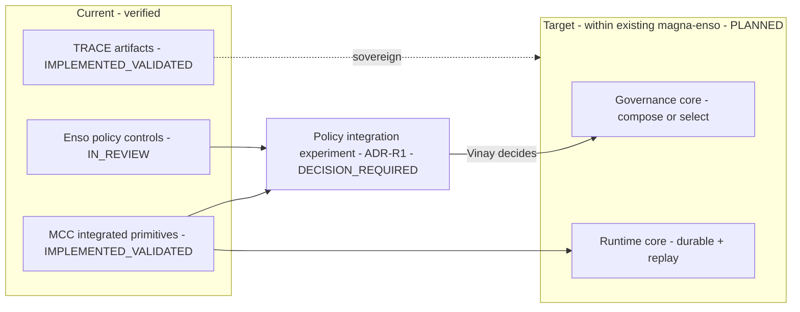

# 15 — Reuse and Migration Architecture

## Human table of contents
1. Reuse classification model
2. Reuse register (Command Center / Enso / TRACE / Hermes)
3. Current-to-target capability transition (DIAG-21)
4. The policy-engine experiment gate (no selection)
5. Open decisions
6. Change-control note

## AI navigation index
- `classification_model` → §1
- `reuse_register` → §2 (full machine list: `technical-specifications/16_...`, `registries/MAGNA_COMPONENT_REGISTRY.yaml`)
- `transition` → §3 (DIAG-21)
- `experiment_gate` → §4 (ADR-R1)

## 1. Reuse classification model
`REUSE_UNCHANGED` · `REUSE_AFTER_REFACTOR` · `EXTRACT_SHARED_COMPONENT` · `REIMPLEMENT_FROM_SPECIFICATION` ·
`HISTORICAL_EVIDENCE_ONLY` · `REJECT` · `DECISION_REQUIRED`. Adapters + contract tests are **preferred to
wholesale copying** ("compatibility without uncontrolled duplication"). Existing Magna and Enso remain
evidence/reuse candidates — neither disposable, obsolete, nor canonical-forward.

## 2. Reuse register (summary; evidence `11`, `05`)

| Source surface | Origin | Classification | Migration risk | Recommended contract boundary |
|---|---|---|---|---|
| Ten-tab shell + task/history UX | Command Center | `REUSE_AFTER_REFACTOR` | Med (bundle size, a11y debt) | UI ↔ API REST/WS contract |
| REST/WebSocket client patterns | Command Center | `REUSE_AFTER_REFACTOR` | Low | API client contract |
| SQLModel persistence + repositories | Command Center | `REUSE_AFTER_REFACTOR` | Med | persistence port |
| Durable event/workflow/approval/orchestration + replay | Command Center | `EXTRACT_SHARED_COMPONENT` | Med | orchestration + event contract |
| Authorization sessions / risk classify | Command Center | `DECISION_REQUIRED` (vs Enso policy) | Med | governance port (ADR-R1) |
| CSF→BRS deterministic routing | Command Center | `REUSE_AFTER_REFACTOR` | Med | routing contract |
| Strict policy JSON schema + canonical fingerprint | Enso | `EXTRACT_SHARED_COMPONENT` | Low | policy decision port |
| Single-use approval consumption + Null/Deny provider | Enso | `EXTRACT_SHARED_COMPONENT` | Low | approval contract |
| Secure hash-chained JSONL audit sink | Enso | `EXTRACT_SHARED_COMPONENT` | Low | audit sink port |
| Adversarial policy tests | Enso | `REUSE_AFTER_REFACTOR` | Low | test suite |
| Repo entry/onboarding + Core artifact schema + Observatory | TRACE | `REUSE_UNCHANGED` (sovereign repo) | Low | TRACE artifact + (target) runtime contract |
| Hermes provenance/license/retained-surface metadata | Hermes | `HISTORICAL_EVIDENCE_ONLY` | n/a | none active (0/6) |

(Each entry needs source path, evidence, test status, coupling, security, provenance, license, migration risk —
machine form in `registries/MAGNA_COMPONENT_REGISTRY.yaml` and `technical-specifications/16_...`.)

## 3. Current-to-target capability transition (DIAG-21)

## 4. The policy-engine experiment gate (ADR-R1) — **no selection here**
Reuse of the governance core is **DECISION_REQUIRED** pending the controlled experiment (`05`, `08`,
`technical-specifications/06_...`). This package **does not** choose the canonical policy engine.

## 5. Open decisions
- OD-15.1 — ADR-R1 governance-core disposition (compose/adapt/replace).
- OD-15.2 — Whether MCC durable persistence is extracted as a shared runtime core for all stages.
- OD-15.3 — Migration sequencing + contract-test suite definition.

## 6. Change-control note
`DRAFT_FOR_HUMAN_REVIEW`. No canonical engine selected. Changes governed; superseded content marked.
