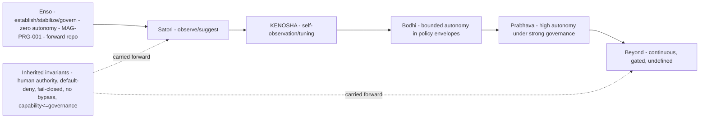

# 16 — Evolution Stage Contracts (corrected, Correction 3)

> **Reconstructed directly from the approved roadmap** (`MAGNA_EVOLUTION_ROADMAP.md`). Each stage has **two
> columns: evidence-confirmed meaning** (from the roadmap) vs **proposed technical interpretation requiring
> human approval**. Where the roadmap does not allocate a concrete capability (memory, orchestration, DR), it
> is marked `DECISION_REQUIRED` — **not** invented. **No uncontrolled autonomy is designed.**

## Human table of contents
1. Inherited invariants (all stages)
2. Stage contracts (two-column) — Satori, KENOSHA, Bodhi, Prabhava, Beyond
3. Enso-to-Beyond evolution diagram (DIAG-22)
4. Open decisions
5. Change-control note

## AI navigation index
- `invariants` → §1 · `stage_contracts` → §2 (MAG-PRG-001) · `diagram` → §3 (DIAG-22)

## 1. Inherited invariants (all stages; roadmap guardrail "awareness after governance")
Human final authority; default-deny; fail-closed; no hidden autonomy; no capability bypass; durable lineage;
replay-safe; separate runtime/engineering evidence; independent verification; **capability never outruns
governance** (roadmap §7). Autonomy rises **only** behind approved governance. SGN-01 stays BLOCKED in its
canonical scope (see `PRESGN_TO_EVOLUTION_RELATIONSHIP_MATRIX.md`).

## 2. Stage contracts (two-column)

> Roadmap autonomy framing is explicit: Enso = **zero autonomy by default**; Satori = observe-and-suggest;
> Kensho = governed self-tuning; Bodhi = bounded autonomy under enforced policy; Prabhava = high within strong
> governance; Beyond = continuous, governance persists. TRACE-affinity per roadmap §6.

### Satori — `decision_status: DECIDED (meaning) / DECISION_REQUIRED (allocation)`
| Evidence-confirmed (roadmap) | Proposed technical interpretation (needs approval) |
|---|---|
| "First awakening — emergent awareness"; Observe·Understand·Align; self-observation telemetry, situational awareness, alignment checks, **assisted (not autonomous) suggestions**; autonomy = observe-and-suggest; `v2.0-satori`; TRACE v2 Assist / L3 | Governed observability + suggestion surface, no consequential autonomy; concrete capability list `DECISION_REQUIRED` |
| Repo: `magna-satori` (separate). Non-goals: autonomous action. |

### KENOSHA — `decision_status: DECIDED (meaning; spelling superseded) / DECISION_REQUIRED (allocation)`
| Evidence-confirmed (roadmap "Kensho") | Proposed technical interpretation (needs approval) |
|---|---|
| "Seeing true nature — clear self-observation"; Integrate·Refine·Expand; deep self-model, capability self-assessment, refined policy reasoning, **governed self-tuning within approved bounds**; structural changes human-gated; `v3.0-kensho`; TRACE v2→v3 / L3-L4 | Governed self-assessment + bounded self-tuning; **memory governance allocation `DECISION_REQUIRED`** (do not assume MEM here) |
| Official spelling **KENOSHA** (decision 5); "Kensho" preserved as historical meaning. Repo: `magna-kenosha`. |

### Bodhi — `decision_status: DECIDED (meaning) / DECISION_REQUIRED (allocation)`
| Evidence-confirmed (roadmap) | Proposed technical interpretation (needs approval) |
|---|---|
| "Mature awakening / wisdom in action"; Decide·Act·Evolve; governed decision-making, **bounded autonomous action within explicit policy envelopes**, approval gates outside the envelope, mature multi-agent orchestration; TRACE v3 Govern / L4-L5; `v4.0-bodhi` | Bounded, revocable, evidenced multi-step action within pre-approved envelopes; **orchestration depth allocation `DECISION_REQUIRED`** |
| Repo: `magna-bodhi`. Non-goals: open-ended self-directed goals. |

### Prabhava — `decision_status: DECIDED (meaning) / DECISION_REQUIRED (allocation)`
| Evidence-confirmed (roadmap) | Proposed technical interpretation (needs approval) |
|---|---|
| "Source / emergence / manifestation"; Create·Connect·Manifest; generative capability composition, cross-domain connection, **high autonomy within strong governance and human strategic authority**; TRACE v3 advanced / L5; `v5.0-prabhava` | Reliability/scale/DR maturity within governance; **DR/scale allocation `DECISION_REQUIRED`** (do not assume) |
| Repo: `magna-prabhava`. Non-goals: removing human final authority. |

### Beyond — `decision_status: DECISION_REQUIRED`
| Evidence-confirmed (roadmap) | Proposed technical interpretation (needs approval) |
|---|---|
| "Continuous evolution beyond current boundaries"; Transcend·Inspire; rolling horizon, **governance and human authority persist regardless of capability**; `Beyond` (rolling) | Intentionally unspecified; autonomy ceiling **undefined and gated**; requires its own governed decision and a separate `magna-beyond` repo decision |

## 3. Enso-to-Beyond evolution architecture (DIAG-22)

## 4. Open decisions
- OD-16.1 — Concrete capability allocation per stage (memory/orchestration/DR) — `DECISION_REQUIRED`, not assigned.
- OD-16.2 — Per-stage entry/exit acceptance criteria (later, per stage).
- OD-16.3 — Beyond's autonomy ceiling + repo creation (separate governed decision).

## 5. Change-control note
`DRAFT_FOR_HUMAN_REVIEW`. Meanings preserved from roadmap; allocations `DECISION_REQUIRED`. No autonomy authorized.
