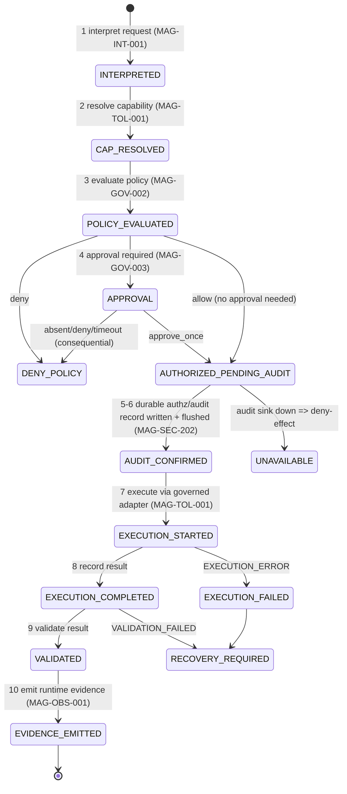

# Spec 18 — State Machine Specifications (Corrections 8 & 10)

> Seven required state machines. Outcomes use the taxonomy in `19`. The **audit-before-effect** order
> (Correction 10) is enforced: an `ALLOW` decision **alone never triggers an effect** — a durable audit record
> must be written and confirmed first. State/transition names not backed by current evidence are **PROPOSED**.

## Human ToC
1. Audit-before-effect order 2. Capability decision 3. Approval lifecycle 4. Workflow lifecycle
5. Task lifecycle 6. Runtime evidence verification 7. Memory draft/persist/discard 8. Release promotion/rollback
9. Open decisions 10. Change-control

## 1. Audit-before-effect order (Correction 10) — `MAG-GOV-001`, `MAG-SEC-202`, `MAG-OBS-001`
Canonical order (no effect before AUDIT_CONFIRMED):

**Invariant:** transitions `AUTHORIZED_PENDING_AUDIT → EXECUTION_STARTED` are impossible without
`AUDIT_CONFIRMED`. An ALLOW with an unconfirmed audit write ⇒ `UNAVAILABLE` ⇒ no effect.

## 2. Capability decision state machine — `MAG-GOV-001`
`RECEIVED → VALIDATED | INVALID_REQUEST | NEEDS_CLARIFICATION → EVALUATED → {ALLOW, DENY_POLICY,
HOLD_FOR_APPROVAL}`. Read-only forbidden ⇒ `DENY_POLICY`; dependency down ⇒ `UNAVAILABLE` (see `19`).

## 3. Approval lifecycle — `MAG-GOV-003` (PROPOSED states)
`REQUESTED → PENDING(HOLD) → {APPROVED_ONCE, DENIED, EXPIRED, REVOKED}`; `APPROVED_ONCE → CONSUMED` (single-use,
fingerprint-checked in a serialized critical section); any mismatch/replay ⇒ `DENIED`. Expiry monotonic; restart
⇒ pending not carried (resets to default-deny). Absent production provider ⇒ `DENIED`.

## 4. Workflow lifecycle — `MAG-ORC-002`
`PENDING → AUTHORIZED → RUNNING → {COMPLETED, FAILED, DENIED, CANCELLED}`; each consequential step passes the
gate; `RUNNING` only after `AUDIT_CONFIRMED` for that step; failure ⇒ `RECOVERY_REQUIRED`.

## 5. Task lifecycle (TRACE Constellation) — `MAG-TRC-201` (engineering plane)
`SCOPED → IN_PROGRESS → EVIDENCE_DRAFT(Light Curve) → IN_REVIEW → {ACCEPTED, CHANGES_REQUESTED}`; acceptance is
human-only; mode history appended across worker handoffs (per TRACE adoption plan).

## 6. Runtime evidence verification — `MAG-TRC-202` (anti-self-certification)
`UNVERIFIED → SUBMITTED(read-only, digested) → INDEPENDENTLY_VERIFIED | VERIFICATION_FAILED`. **Magna cannot
self-set `INDEPENDENTLY_VERIFIED`** — a separate verifier identity recomputes from durable events. Default
`UNVERIFIED`.

## 7. Memory draft/persist/discard — `MAG-MEM-002`
`DRAFT → {PERSIST_REQUESTED → HOLD_FOR_APPROVAL → PERSISTED, DISCARDED}`. Persistence is an approval; no silent
mutation; discard is clean and reversible. (Sprint 8 governance.)

## 8. Release promotion/rollback — component `MAG-ENV-001`; requirements `MAG-OPS-002` (backup), `MAG-OPS-003` (rollback), `MAG-OPS-004` (release)
`BUILD → RC(UAT) → {ACCEPTED→PROMOTED(Local Production), REJECTED}`; rollback `PROMOTED → ROLLED_BACK(restore
snapshot + replay)`. **Tags are not releases**; promotion requires signed human acceptance; evidence retained
even on rollback.

## 9. Open decisions
- OD-18.1 — Final state names/fields are PROPOSED until ADR-R1 (engine composition) resolves.
- OD-18.2 — Whether workflow/step audit is per-step or per-workflow (default: per consequential step).

## 10. Change-control note
`DRAFT_FOR_HUMAN_REVIEW`. ALLOW alone ≠ effect. PROPOSED states marked. Governed; nothing deleted.
