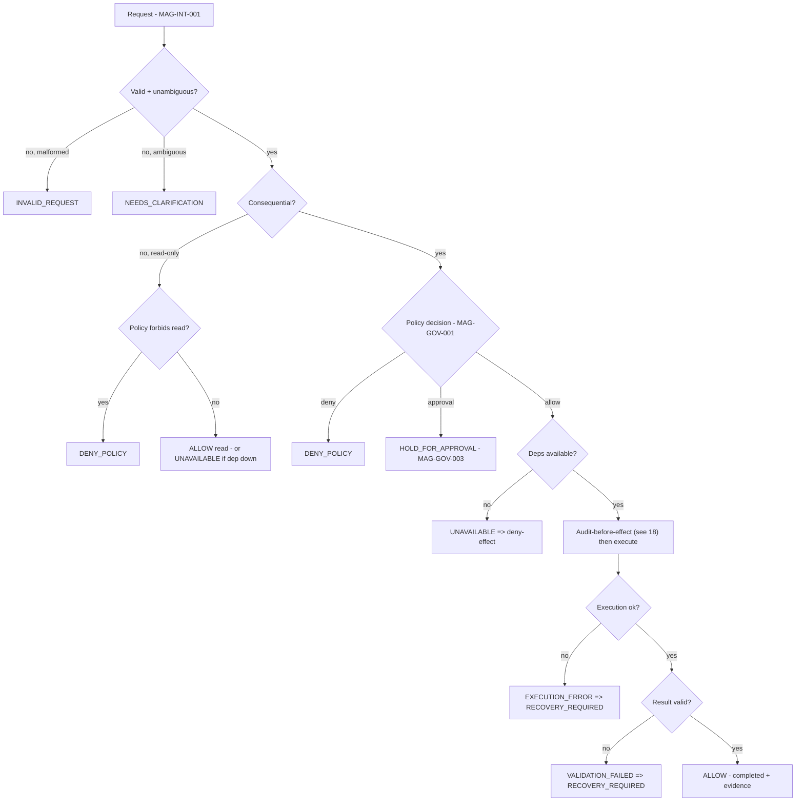

# Spec 19 — Failure and Outcome Taxonomy (Correction 9)

> The `-draft` package collapsed many conditions into `DENY`. This taxonomy distinguishes a **policy denial**
> from an **invalid request**, an **unavailable dependency**, an **execution error**, etc. **Consequential
> actions still fail closed** (any uncertainty ⇒ no effect), but a read-only/non-consequential operation may
> return its own honest outcome rather than be misreported as a policy denial.

## Human ToC
1. Outcome set (10 values) 2. Consequential vs non-consequential 3. Mapping rules 4. Outcome decision (DIAG ref)
5. Impact on diagrams/specs/APIs/tests 6. Acceptance 7. Open decisions 8. Change-control

## 1. Outcome set (the only allowed outcomes)

| Outcome | Meaning | Fail-closed? |
|---|---|---|
| `ALLOW` | Authorized; effect may proceed **after** audit confirmed (see `18`) | n/a |
| `DENY_POLICY` | A policy/default-deny decision refused it | n/a (is the closure) |
| `HOLD_FOR_APPROVAL` | Awaiting an authenticated human decision; no effect yet | yes (no effect while held) |
| `NEEDS_CLARIFICATION` | Ambiguous/underspecified request; ask, do not guess | yes for consequential |
| `INVALID_REQUEST` | Malformed/schema-invalid/over-privileged request | yes for consequential |
| `UNAVAILABLE` | A dependency (store/provider/audit sink) is unavailable | **consequential ⇒ deny-effect** |
| `EXECUTION_ERROR` | Adapter/effect failed during execution | yes (record + recover) |
| `VALIDATION_FAILED` | Post-execution result failed validation | yes (mark RECOVERY_REQUIRED) |
| `CANCELLED` | Human/system cancelled before/while executing | yes (no/aborted effect) |
| `RECOVERY_REQUIRED` | State needs recovery (e.g. crash mid-effect, corrupt audit) | yes (default-deny until recovered) |

## 2. Consequential vs non-consequential
- **Consequential action** (writes, external calls, capability execution): on **any** non-`ALLOW` outcome,
  **no effect occurs** — fail closed. `UNAVAILABLE`/`EXECUTION_ERROR`/`VALIDATION_FAILED` ⇒ no/aborted effect.
- **Non-consequential / read-only** (status query, list, read): may return `INVALID_REQUEST`,
  `NEEDS_CLARIFICATION`, or `UNAVAILABLE` **as itself** — it is **not** dressed up as `DENY_POLICY`. A read
  that the policy genuinely forbids still returns `DENY_POLICY`.

## 3. Mapping rules (replaces "everything → DENY")
- No policy record / default-deny / forbidden ⇒ `DENY_POLICY`.
- Approval needed ⇒ `HOLD_FOR_APPROVAL`; provider absent/denied/timeout for a **consequential** action ⇒
  `DENY_POLICY` (fail closed); for a read-only request, surface the real reason.
- Bad input ⇒ `INVALID_REQUEST`; ambiguous ⇒ `NEEDS_CLARIFICATION`.
- Store/provider/audit down ⇒ `UNAVAILABLE` (consequential ⇒ deny-effect).
- Adapter throws ⇒ `EXECUTION_ERROR`; post-check fails ⇒ `VALIDATION_FAILED` ⇒ `RECOVERY_REQUIRED`.

## 4. Outcome decision (diagram)

## 5. Impact on diagrams / specs / APIs / tests
- Diagrams `08` (DIAG-10) and `13`/`10` (DIAG-20) updated to branch outcomes, not a single DENY.
- Specs `03`,`06`,`13` reference this taxonomy; PROPOSED API responses carry an `outcome` field from this set.
- Test strategy (`14`): outcome-specific tests — a read-only `UNAVAILABLE` is **not** asserted as `DENY_POLICY`;
  consequential fail-closed proven for `UNAVAILABLE/EXECUTION_ERROR/VALIDATION_FAILED`.

## 6. Acceptance
Every governed code path returns exactly one outcome from §1; consequential paths never produce an effect on a
non-`ALLOW` outcome; read-only paths are not mislabeled as policy denials.

## 7. Open decisions
- OD-19.1 — Final outcome→HTTP/exit mapping for the PROPOSED API (post-ADR-R1).
- OD-19.2 — Whether `NEEDS_CLARIFICATION` is surfaced in UI as a distinct state (links UX spec).

## 8. Change-control note
`DRAFT_FOR_HUMAN_REVIEW`. Consequential = fail closed. Read-only not mislabeled. Governed; nothing deleted.
