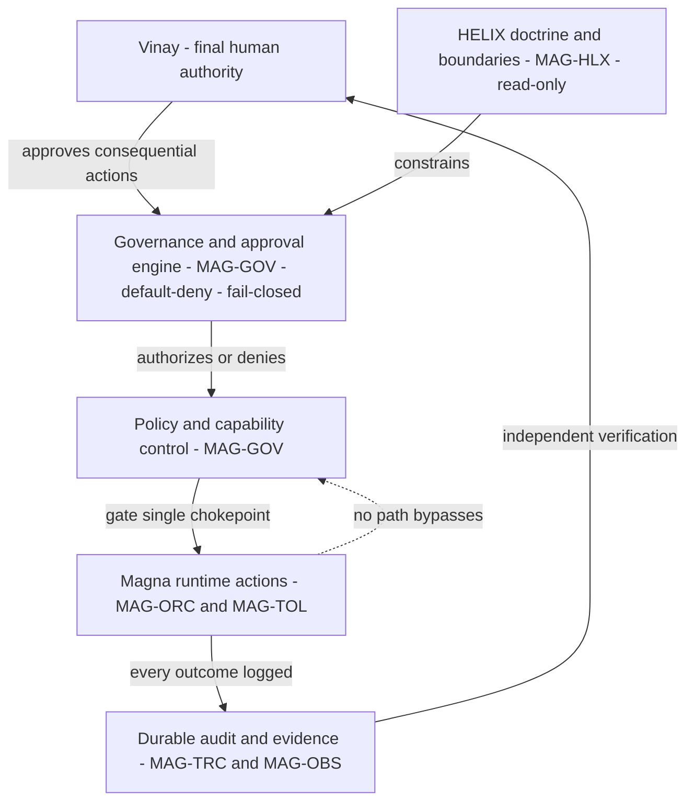
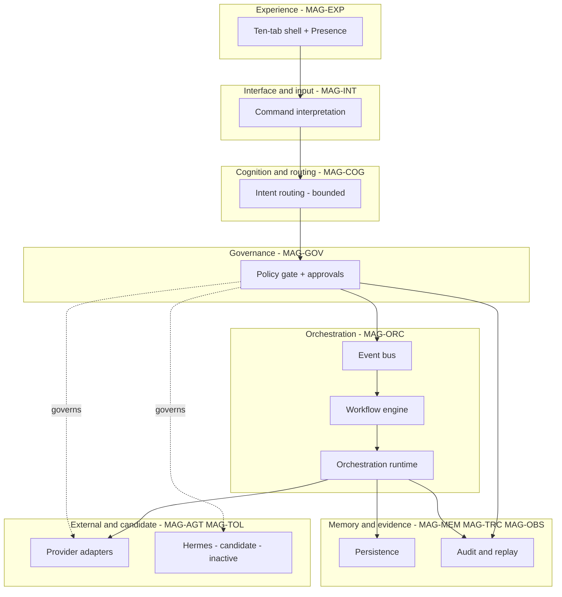

# 03 — Magna Program Architecture

## Human table of contents
1. Program intent
2. HELIX ↔ Magna relationship (constraint, not control)
3. Human authority & governance hierarchy (DIAG-02)
4. Program-level logical layers (DIAG-01)
5. Pre-SGN belt as the program readiness spine
6. What is verified-current vs target at program level
7. Open decisions
8. Change-control note

## AI navigation index
- `helix_relationship` → §2 (MAG-HLX, MAG-PRG)
- `authority_hierarchy` → §3 (DIAG-02, MAG-GOV)
- `program_layers` → §4 (DIAG-01)
- `presgn_spine` → §5 (MAG-GOV, MAG-COG)

## 1. Program intent
Magna is one **living cognitive orchestration environment** for a single human owner, evolving through named
stages, each governed, replay-safe, and local-first. The program's job is to let Vinay express intent and have
it routed, governed, executed (only when permitted), evidenced, and remembered — **without** hidden autonomy
or capability bypass. HELIX encodes *what Magna is allowed to be*; Magna *decides and acts within that*; Vinay
*ratifies and approves*.

## 2. HELIX ↔ Magna relationship (MAG-HLX → MAG-PRG)
- **HELIX is read-only doctrine and observability.** It informs and constrains Magna and can *visualize*
  runtime, but **never mutates** runtime state (Constitution Law III). `Status: ACCEPTED_AND_VALIDATED` as a
  documented principle; HELIX as an executable surface beyond Command Center's documentation/observability is
  `PLANNED`/`UNKNOWN` and must not be described as a running subsystem.
- **Magna is the actor.** It decides, orchestrates, and acts within HELIX's constraints and policy.
- **Cosmos and Identity are distinct** (see `02`, `07 spec`): Identity = current truthful capability; Cosmos =
  ratified evolution.

## 3. Human authority & governance hierarchy (DIAG-02, MAG-GOV)

**Approval points (human-gated):** consequential capability execution, draft persistence, commit/push/merge,
stage promotion, Hermes activation, SGN-01 unblock. **No worker self-approves.**

## 4. Program-level logical layers (DIAG-01)

Status per layer is in `registries/MAGNA_COMPONENT_REGISTRY.yaml`. Verified-current layers are concentrated in
Command Center (UI, EB/WF/OR, persistence, observability, providers); the **single-chokepoint policy gate** is
the strongest in Enso's harness but is **not yet proven** as a universal runtime chokepoint (`05`).

## 5. Pre-SGN belt as the program readiness spine (MAG-GOV, MAG-COG)

| Layer | Status (evidence `04`) |
|---|---|
| HAB-01 (habitable surfaces / UI shell freeze) | `ACCEPTED_AND_VALIDATED` |
| ATM-01 (permission/risk/authorization/approval) | `ACCEPTED_AND_VALIDATED` (some boundaries remain advisory) |
| CSF-01 (conscious self-model truth registry) | `ACCEPTED_AND_VALIDATED` |
| BRS-01 (routing layer) | `IMPLEMENTED_VALIDATED` / `AWAITING_HUMAN_ACCEPTANCE` |
| MEM-01 (memory formation) | `IN_PROGRESS` / pending belt layer |
| NRV-01 (nervous-system visibility) | `IN_PROGRESS` / pending belt layer |
| SGN-01 (broad command intelligence) | **`BLOCKED`** |

Accepted readiness = **3/6 (50%)**; code+current-validation = **4/6 (66.7%)** — not interchangeable; never
combined into a single "completion %." **SGN-01 remains blocked under either metric.**

## 6. Verified-current vs target (program level)
- **Verified-current:** Command Center runtime spine; Pre-SGN HAB/ATM/CSF accepted; BRS implemented+validated.
- **Target:** clean Magna Enso target architecture; HELIX/Cosmos as governed runtime surfaces beyond docs;
  cross-plane TRACE; cognition as a governed routing runtime; environment topology beyond local/test.
- **Never claim:** that the program is "one running Magna" today — it is a program with one strong verified
  runtime (Command Center), one harness-level policy candidate (Enso), and an engineering-governance toolkit
  (TRACE).

## 7. Open decisions
- OD-03.1 — Whether the clean program runtime composes Command Center primitives + Enso policy, or selects one
  (after the `05` experiment) — see `17` ADR-R1.
- OD-03.2 — HELIX's target executable scope vs documentation/observability-only scope (`12` item 2).

## 8. Change-control note
`DRAFT_FOR_HUMAN_REVIEW`. Program framing is conceptual; component status is authoritative per registry.
Changes are governed; superseded content marked, not deleted.
