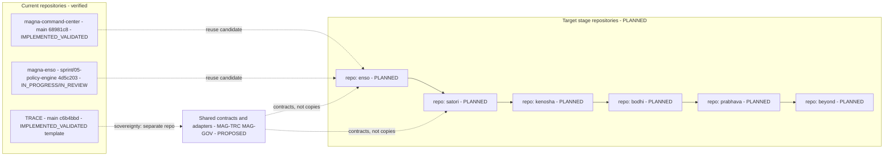

# 04 — Evolution and Repository Architecture

## Human table of contents
1. Official stage sequence
2. Separate-repository strategy (and the historical one-repo/tag decision)
3. Versioning and release semantics
4. Repository & versioning diagram (DIAG-03)
5. Evolution diagram (DIAG-22 lives in `16`)
6. Supersession discipline
7. Open decisions
8. Change-control note

## AI navigation index
- `stages` → §1 (MAG-PRG)
- `repo_strategy` → §2 (MAG-PRG, MAG-ENV)
- `versioning` → §3
- `supersession` → §6 (MAG-GOV)

## 1. Official stage sequence (human-owner authoritative)
**Enso → Satori → Kenosha → Bodhi → Prabhava → Beyond.**
- The official third stage spelling is **KENOSHA** (human authority). Repository evidence still shows legacy
  **"Kensho"**; that remains historical and must be marked `SUPERSEDED` through governance, **never deleted**
  (`00` correction 1; `12` item 1).
- Each stage is **intended to be its own repository and independently usable** (`00` correction 2).
- Detailed architecture/specs are produced **now for Enso only**; later stages get intent, boundaries, and
  evolution contracts (`16`), not premature implementation detail.

## 2. Separate-repository strategy
- **Target:** one repository per evolutionary stage, each independently runnable; compatibility achieved via
  **shared contracts and adapters**, *not* uncontrolled code duplication ("compatibility without uncontrolled
  duplication"; "no cognitive monolith").
- **Historical:** the earlier "one repository, evolve via tags/releases" decision is **historical** and must be
  formally `SUPERSEDED` by a governed Event Horizon entry — preserved, not rewritten (`00` correction 2; `12`
  items 1, 10). `Status: this supersession is PLANNED / DECISION_REQUIRED.`
- **Current repo facts (verified, `01` §2):** `magna-command-center` @ `main` `68981c8`; `magna-enso` @
  `sprint/05-policy-engine` `4d5c203`; `TRACE` @ `main` `c6b4bbd`. These are distinct repositories already.

## 3. Versioning and release semantics
- **Tags do not establish releases.** No reviewed repository has production/UAT/DR proof (`00` correction 9;
  `10`). A release requires artifact + signed acceptance + environment evidence (see `13 spec`, `15 spec`).
- Proposed (PROPOSED) versioning for the clean stages: semantic stage line (e.g. `enso-vMAJOR.MINOR.PATCH`)
  plus a governed **Cosmos** ratification entry per stage milestone. Cross-stage compatibility is expressed by
  **contract versions** in `registries/MAGNA_INTERFACE_REGISTRY.yaml`, not by shared source trees.

## 4. Repository & versioning architecture (DIAG-03)

> **TRACE repository sovereignty:** TRACE remains its own repository; stage repos *consume* TRACE artifacts and
> (target) the runtime contract, they do not absorb TRACE.

## 5. Evolution diagram
The Enso→Beyond capability/governance/autonomy maturity diagram is **DIAG-22**, defined in `16` and listed in
`18`. Autonomy ceilings rise only behind approved governance; **no uncontrolled autonomy** is designed.

## 6. Supersession discipline (MAG-GOV)
1. A superseding decision gets a **new accepted Event Horizon ID** and text.
2. The prior decision is annotated `SUPERSEDED` with a pointer to the new ID.
3. History is **never deleted or silently rewritten** (`00` correction 2; `12` items 1, 10).
4. Coordinated update order (naming + repo strategy) is itself an open decision (`12` item 1).

## 7. Open decisions
- OD-04.1 — Exact superseding Event Horizon IDs/text + coordinated update order for stage naming and repo
  strategy (`12` item 1).
- OD-04.2 — Whether/when historical planning/status files are amended vs annotated-as-superseded (`12` item 10).
- OD-04.3 — Stage versioning scheme and Cosmos ratification cadence (PROPOSED above).

## 8. Change-control note
`DRAFT_FOR_HUMAN_REVIEW`. Stage naming/repo strategy are human-owner authoritative intent; supersession is
governed; nothing is deleted.
