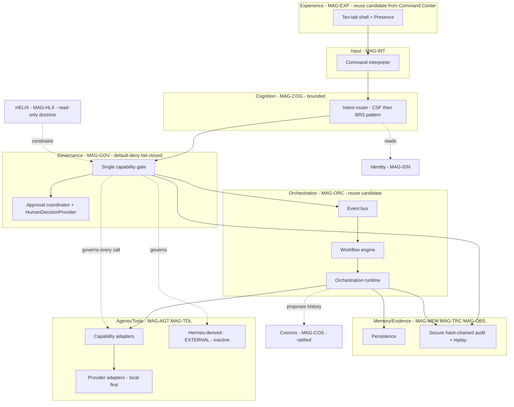

# 06 — Magna Enso Target Architecture (TARGET)

> **Target, not current.** Every component below is `PLANNED`, `CANDIDATE_FOR_REUSE`, or `DECISION_REQUIRED`
> unless it points to a verified-current surface in `05`. The clean Enso project is **not authorized** here;
> creation is gated by `13`.

## Human table of contents
1. Target intent and non-goals
2. Target logical architecture (DIAG-06)
3. Layer-by-layer target responsibilities
4. The composition question (compose vs select)
5. Foundation gate dependency
6. Open decisions
7. Change-control note

## AI navigation index
- `target_logical` → §2 (DIAG-06)
- `layers` → §3
- `composition_question` → §4 (ADR-R1, MAG-GOV MAG-ORC)
- `foundation_gate` → §5 (`13`)

## 1. Target intent and non-goals
**Intent:** a single-user, local-first Enso runtime that takes a command, routes it through bounded cognition,
governs every capability through **one default-deny, fail-closed chokepoint**, executes only permitted
actions, and emits **durable, replay-safe, independently verifiable** evidence — with HELIX read-only and
Vinay as final authority.
**Non-goals (Enso stage):** broad autonomous command intelligence (SGN-01 `BLOCKED`); multi-user; public
deployment; ambient/wake-word voice; active Hermes capabilities; first-class autonomous working memory;
self-certification of evidence.

## 2. Target logical architecture (DIAG-06)

## 3. Layer-by-layer target responsibilities

| Layer | Arch ID | Target responsibility | Likely source disposition |
|---|---|---|---|
| Experience | MAG-EXP | Frozen ten-tab shell + Presence + approval/recovery surfaces | `REUSE_AFTER_REFACTOR` (Command Center) |
| Input | MAG-INT | Parse command → structured intent; no privilege from payload | `REIMPLEMENT_FROM_SPECIFICATION` |
| Cognition | MAG-COG | Bounded routing (CSF→BRS pattern); no architecture/governance ownership | `REUSE_AFTER_REFACTOR` (Command Center routing) |
| Governance | MAG-GOV | One default-deny, fail-closed gate; approval coordinator; fingerprint binding | `EXTRACT_SHARED_COMPONENT` (Enso policy) + Command Center approval lifecycle — `DECISION_REQUIRED` |
| Orchestration | MAG-ORC | Event bus, workflow, orchestration with durable lineage | `REUSE_AFTER_REFACTOR` (Command Center) |
| Memory/Evidence | MAG-MEM/MAG-TRC/MAG-OBS | Persistence + secure audit + replay; governed memory | compose: Command Center durability + Enso secure audit — `DECISION_REQUIRED` |
| Agents/Tools | MAG-AGT/MAG-TOL | Provider-neutral adapters; capability adapters behind the gate | `REUSE_AFTER_REFACTOR` / `REIMPLEMENT` |
| Hermes | MAG-TOL | `EXTERNAL`, inactive; only behind approved governance | `HISTORICAL_EVIDENCE_ONLY` (provenance metadata) |

## 4. The composition question (compose vs select) — ADR-R1
The decisive architectural question: does Enso **compose** Command Center's integrated runtime primitives
(durable event/workflow/approval/orchestration, replay) with Enso's **strict policy controls** (schema,
canonical fingerprint, secure audit, single chokepoint), or **select one** implementation? Evidence (`05`)
shows complementary strengths and gaps. **This package does not choose.** It requires the controlled
experiment (`08`, `06 spec`, `14 spec`): one read-only, one local-write, one external/approval-required
capability contract routed through adapters for both engines, testing parameter substitution, replay, restart,
audit failure, direct-entry bypass, and authorization identity.

## 5. Foundation gate dependency
The clean Enso project is **not** created until all gates in `13` (authority, canonical truth, architecture,
TRACE dual-plane, UX, environment, backlog, validation, governance, creation decision) have explicit evidence
and Vinay's recorded decision. Passing earlier gates does **not** imply creation authorization.

## 6. Open decisions
- OD-06.1 — ADR-R1: compose vs select runtime/policy engine (after `05` experiment).
- OD-06.2 — Whether the existing Enso Sprint 5 components are extracted as the governance core or reimplemented.
- OD-06.3 — Target boundary of HELIX/Cosmos as runtime surfaces vs read-only docs (links `03` OD-03.2).

## 7. Change-control note
`DRAFT_FOR_HUMAN_REVIEW`. Entirely target/conceptual except where it cites `05`. Changes governed; no deletion.
