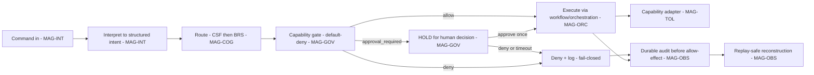
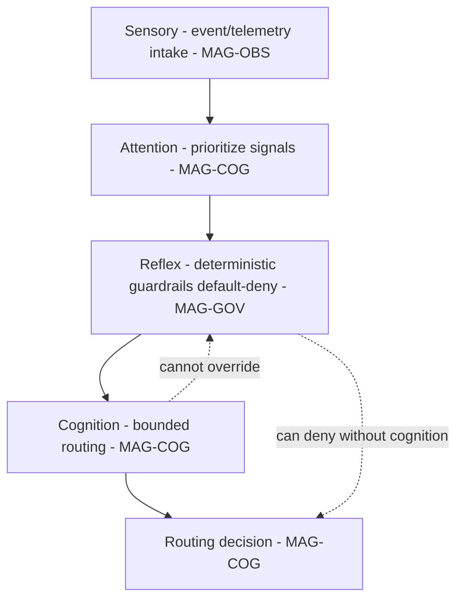
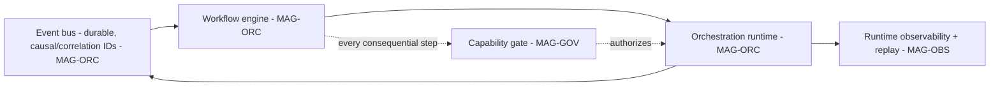

# 07 — Request-to-Action and Cognition

## Human table of contents
1. Request-to-action pipeline (DIAG-07)
2. Sensory / attention / reflex / cognition / routing (DIAG-08)
3. Event bus, workflow, orchestration (DIAG-09)
4. Where the human-approval points sit
5. Bounded-cognition guarantees
6. Open decisions
7. Change-control note

## AI navigation index
- `pipeline` → §1 (DIAG-07, MAG-INT MAG-COG MAG-GOV MAG-ORC)
- `sensory_cognition` → §2 (DIAG-08, MAG-COG)
- `event_orchestration` → §3 (DIAG-09, MAG-ORC)
- `approval_points` → §4 (MAG-GOV)

## 1. Request-to-action pipeline (DIAG-07) — `Status: TARGET (routing pattern reuses verified MCC)`

**Invariant:** no path reaches `EXEC` without passing `GATE`; every branch logs; `ALLOW` effects are not
emitted before a durable audit record exists (audit-before-allow).

## 2. Sensory / attention / reflex / cognition / routing (DIAG-08) — `Status: PARTLY TARGET`
Mapping to Magna's canonical terms (`02`): the **nervous system** (event bus, telemetry, observability) is the
sensory/attention substrate; **reflex** = deterministic guardrails (default-deny, schema/permission checks)
that act without model reasoning; **cognition** = bounded routing/orchestration intelligence that **does not
own governance**.

> Reflex (deterministic deny/guardrails) can stop an action **without** cognition; cognition can **never**
> override reflex/governance. This encodes "no hidden autonomy" and "no capability bypass."

## 3. Event bus, workflow, orchestration (DIAG-09) — `Status: REUSE_AFTER_REFACTOR (verified in MCC)`

Command Center already implements durable events with causal/correlation fields, workflow/approval/
orchestration linkage, WebSocket delivery, observability, and replay (`03`, `06`). Target Enso reuses this
pattern with the single-chokepoint gate inserted before every consequential step.

## 4. Human-approval points (MAG-GOV)
- `approval_required` capability execution → HOLD until an authenticated human decision (Enso ships only a
  **test-only** provider; **production provider absent ⇒ DENY**).
- Draft persistence (memory/skill) → persists only on human acceptance.
- Commit/push/merge, stage promotion, Hermes activation, SGN-01 unblock → all human-gated; no worker self-approves.

## 5. Bounded-cognition guarantees
- Cognition routes and proposes; it does **not** mint authority, change policy, or bypass the gate.
- Payload content cannot escalate privilege ("input-driven escalation ⇒ DENY").
- Reflex/governance is deterministic and precedes cognition.

## 6. Open decisions
- OD-07.1 — Exact router contract for the clean Enso (reuse MCC `intent_router` vs reimplement) — links ADR-R1.
- OD-07.2 — Whether reflex guardrails live in the gate only or also at the bus boundary (defense in depth).

## 7. Change-control note
`DRAFT_FOR_HUMAN_REVIEW`. Pipeline is target; routing/orchestration patterns cite verified MCC. Changes governed.
