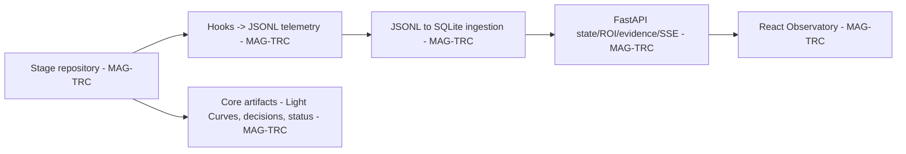
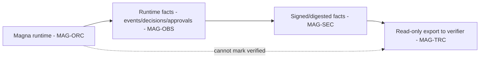
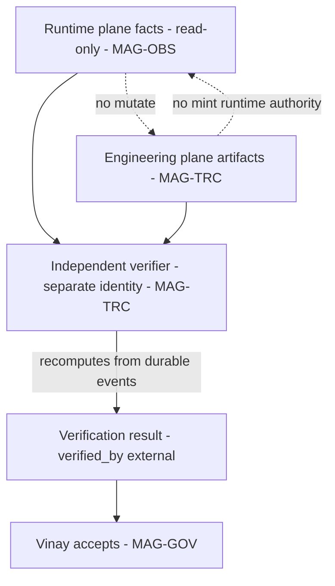

# 09 — TRACE Dual-Plane Architecture

## Human table of contents
1. The two planes (and why they stay separate)
2. Engineering plane (DIAG-14) — partly current
3. Runtime plane (DIAG-15) — target
4. Cross-plane interoperability + anti-self-certification (DIAG-16)
5. Minimum cross-plane schema
6. Open decisions
7. Change-control note

## AI navigation index
- `two_planes` → §1 (MAG-TRC)
- `engineering_plane` → §2 (DIAG-14)
- `runtime_plane` → §3 (DIAG-15)
- `cross_plane` → §4 (DIAG-16)
- `schema` → §5

## 1. The two planes (human-owner decision 13)
- **Engineering plane:** Magna is *designed, implemented, tested, reviewed* using TRACE (task packets, Light
  Curves, decisions, validation). `Status: IMPLEMENTED_VALIDATED (template) + IN_PROGRESS (effectiveness)`.
- **Runtime plane:** Magna *emits* operational traceability for requests/context/decisions/policies/approvals/
  actions/results/failures/memory effects. `Status: PLANNED` (Command Center has rich runtime traceability,
  but it is **not** connected to TRACE's schema — `06`).
- **They stay separate and independently verifiable.** Magna must **not** certify its own output.

## 2. Engineering plane (DIAG-14) — partly current

Verified (`06`): template + local telemetry + Observatory; backend 6 tests pass, lint passes; **UI build not
reproducible** (missing Rollup binary). **Effectiveness (context efficiency, reproducible handoff, status-drift
prevention) is NOT established** — artifact coverage ≠ effectiveness.

## 3. Runtime plane (DIAG-15) — TARGET

Runtime may emit **signed/digested facts**; it **cannot** set verification status to `verified` for its own
output (`07`). Command Center's durable events/replay are the reuse substrate; the TRACE-schema connection is
target.

## 4. Cross-plane interoperability + anti-self-certification (DIAG-16) — TARGET

**Rules (`07`):** stable cross-plane IDs; one plane cannot silently mint authority in the other; runtime may
*propose* evidence links but cannot update acceptance, supersede decisions, close risks, or certify release;
TRACE must **not** ingest secrets/raw `.env`/unrestricted prompts; verification is done by a **separate
read-only process/identity**.

## 5. Minimum cross-plane schema (PROPOSED — `07`)
`trace_id`, `plane`, `event_id`, `task_id`, `correlation_id`, `causation_id`, `actor`, `source`, `occurred_at`,
`artifact_uri`, `content_digest`, `policy_version`, `privacy_class`, `replay_safe`, `verification_status`,
`verified_by`, `verified_at`. `verification_status` defaults to `unverified`; **Magna cannot self-set
`verified`.**

## 6. Open decisions
- OD-09.1 — Canonical cross-plane contract, verifier identity, retention, privacy classes, signing/digest
  strategy (`12` item 3).
- OD-09.2 — TRACE evidence reproducibility standard: raw output, digests, task-packet instances, route-use
  logs, handoff records (`12` item 9).
- OD-09.3 — Fix TRACE UI build reproducibility (missing Rollup optional binary) (`06`, `13` gate 8).

## 7. Change-control note
`DRAFT_FOR_HUMAN_REVIEW`. Engineering plane partly current; runtime/cross-plane target. Changes governed.
