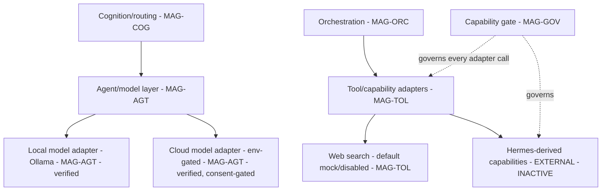

# 11 — Agents, Models, Tools, and Hermes

## Human table of contents
1. Provider neutrality & worker replaceability
2. Agents/models/tools/adapters (DIAG-13)
3. The Hermes-derived capability boundary (0/6 active)
4. Local/cloud consent
5. Open decisions
6. Change-control note

## AI navigation index
- `provider_neutrality` → §1 (MAG-AGT)
- `adapters` → §2 (DIAG-13, MAG-AGT MAG-TOL)
- `hermes_boundary` → §3 (MAG-TOL, EXTERNAL)
- `consent` → §4 (MAG-SEC)

## 1. Provider neutrality & worker replaceability
Models/workers are **replaceable** behind adapters; no provider is load-bearing for architecture or
governance. Verified-current (`03`): local Ollama adapter, env-gated OpenAI review, default-mock web search.
Workers (Claude/Codex/Antigravity/Grok/etc.) **propose and recommend; none self-approves** (`08`).

## 2. Agents / models / tools / adapters (DIAG-13)

Every adapter call is **behind the gate**; an adapter cannot be a bypass path.

## 3. The Hermes-derived capability boundary (MAG-TOL, EXTERNAL) — **0/6 active**
- Hermes is an **audited candidate** capability source. Active/integrated in Enso: **0 of 6** families
  (terminal, browser, messaging, agent, memory, tools) (`10`). The inert vendor baseline and policy metadata
  **do not count as activation**.
- Current reuse value: **provenance/license/retained-surface metadata only** (`HISTORICAL_EVIDENCE_ONLY`).
- Hermes-derived capabilities may evolve through later stages **only behind approved governance, policy,
  evidence, and human authority**. **No Hermes capability is described as active anywhere in this package.**

## 4. Local/cloud consent (MAG-SEC)
Local-first by default; any cloud/provider call is **explicit, consent-gated**, and recorded with provider/
model/config digest and local/cloud classification (`07` provider-call contract). Secrets and full sensitive
payloads are never exported by default.

## 5. Open decisions
- OD-11.1 — Which provider adapters are reused vs reimplemented for the clean Enso (links ADR-R1).
- OD-11.2 — The governance/policy/evidence gate a Hermes family must pass before *any* future activation
  (separate, later, human-approved).
- OD-11.3 — Worker registry/role binding for the clean Enso (TRACE role registry reuse).

## 6. Change-control note
`DRAFT_FOR_HUMAN_REVIEW`. Hermes inactive (0/6). Changes governed; superseded content marked, not deleted.
