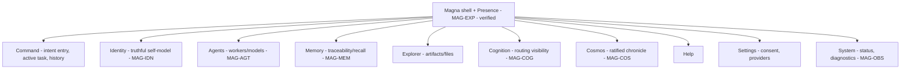

# 12 — UX Information Architecture

## Human table of contents
1. The frozen canonical shell (ten tabs)
2. Ten-tab information architecture (DIAG-17)
3. Primary journeys, Presence, approval & recovery states
4. Accessibility, responsiveness, performance (target acceptance)
5. Open decisions
6. Change-control note

## AI navigation index
- `frozen_shell` → §1 (MAG-EXP)
- `ten_tab_ia` → §2 (DIAG-17)
- `journeys` → §3 (MAG-EXP)
- `a11y_responsive_perf` → §4 (MAG-UX)

## 1. The frozen canonical shell (MAG-EXP) — **FROZEN, do not alter**
Verified ten routes (`03`): **Command, Identity, Agents, Memory, Explorer, Cognition, Cosmos, Help, Settings,
System.** These must **not** be removed, renamed, merged, or rerouted (HAB-01 UI surface freeze). No autonomy
controls are introduced before the permission architecture is approved.

## 2. Ten-tab information architecture (DIAG-17)

## 3. Primary journeys, Presence, approval & recovery states
- **Journeys:** issue a command → watch routing/cognition → hit a governed action → approve/deny → see result
  + evidence; review history; inspect identity/cosmos; manage settings/consent.
- **Presence:** UI projection of Magna; **not** autonomous authorship (`02`).
- **Approval & recovery:** dedicated approval surface and recovery states exist in MCC (`08`). Loading/empty/
  error handling exists but is **uneven** across panels; API errors normalized in `apiClient.ts`.
- **Offline/degraded:** local-first; degraded behavior when providers/cloud are unavailable must be explicit
  (target acceptance criterion).

## 4. Accessibility, responsiveness, performance (MAG-UX) — **target acceptance baseline**
No comprehensive a11y audit, responsive breakpoint matrix, keyboard-nav evidence, or visual-regression suite
exists (`08`). Build emits a **large-bundle warning (1.85 MB JS, ~500 KB gzip)**. Target acceptance (PROPOSED):
WCAG 2.1 AA target, defined desktop breakpoints, keyboard-navigable approval flow, performance budget for the
shell, and a visual-regression baseline. UX readiness today = **6/10 gates** (`10`).

## 5. Open decisions
- OD-12.1 — UX acceptance baseline: a11y target, responsive boundary, performance budget, visual regression
  (`12` item 8; `13` gate 5).
- OD-12.2 — Whether/how Presence surfaces approval state without implying autonomy.

## 6. Change-control note
`DRAFT_FOR_HUMAN_REVIEW`. **Ten-tab shell is frozen.** Changes governed; superseded content marked, not deleted.
