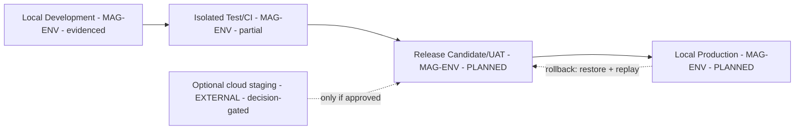

# 13 — Environment, Deployment, and Operations

## Human table of contents
1. Single-user local-first principle
2. The four minimum environments
3. Environment/release architecture (DIAG-18)
4. Current environment evidence
5. Open decisions
6. Change-control note

## AI navigation index
- `local_first` → §1 (MAG-ENV)
- `environments` → §2 (MAG-ENV)
- `release_arch` → §3 (DIAG-18)
- `current_evidence` → §4

## 1. Single-user local-first principle
Design for one user, locally, **without unnecessary cloud/SaaS**. Cloud staging/hosted environments remain
**optional and decision-gated**, never assumed.

## 2. The four minimum environments (MAG-ENV) — target definitions

| Env | Purpose | Data isolation | Secrets | Model/provider | Network | Backup | Promotion | Rollback | Evidence required |
|---|---|---|---|---|---|---|---|---|---|
| Local Development | Build/iterate | Dev DB/dirs only | local `.env`, never in TRACE | local Ollama; cloud opt-in | loopback/LAN | dev snapshot | manual | discard branch | build + unit logs |
| Isolated Test/CI | Deterministic tests | ephemeral fixtures | none/mocked | mocked/local | none | none | gate on green | re-run | raw test output + digests |
| Release Candidate/UAT | Human acceptance | UAT copy | UAT-scoped | as prod-local | local | UAT snapshot | human sign-off | restore snapshot | signed acceptance + Light Curve |
| Local Production | Vinay's daily runtime | prod DB/dirs | prod-scoped local | local-first; cloud consented | local | scheduled backup | human-gated | restore + replay | release artifact + acceptance + backup proof |

## 3. Environment / release architecture (DIAG-18)

## 4. Current environment evidence (`08`, `10`)
- **Evidenced:** Local/dev (strongest), Test (MCC + TRACE backend tests; Enso unittest; **Enso pytest broken**).
- **Absent:** dedicated integration environment, staging, UAT, production, DR — no deployment proof, rollback
  rehearsal, monitoring SLOs, or DR evidence. Environment readiness = **2/7 (28.6%)**; release readiness =
  **3/12 (25%)**. **Tags are not releases.**

## 5. Open decisions
- OD-13.1 — Environment topology + release gates for integration/staging/UAT/production/rollback/DR
  (`12` item 7; `13` gate 6).
- OD-13.2 — Backup/restore + replay-based recovery standard for Local Production.
- OD-13.3 — Whether any cloud staging is adopted (default: no).

## 6. Change-control note
`DRAFT_FOR_HUMAN_REVIEW`. Cloud optional/decision-gated. Changes governed; superseded content marked.
