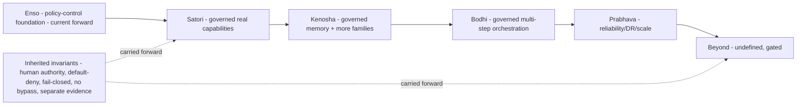

# 16 — Evolution Stage Contracts

> **Enso receives detailed architecture/specs** (`06`, `technical-specifications/`). **Later stages receive
> only intent, boundaries, and evolution contracts** — not premature implementation detail. **No uncontrolled
> autonomy is authorized or designed.**

## Human table of contents
1. Contract template (per stage)
2. Stage contracts: Satori, Kenosha, Bodhi, Prabhava, Beyond
3. Enso-to-Beyond evolution architecture (DIAG-22)
4. Inherited invariants (all stages)
5. Open decisions
6. Change-control note

## AI navigation index
- `template` → §1
- `stage_contracts` → §2 (MAG-PRG)
- `evolution_diagram` → §3 (DIAG-22)
- `inherited_invariants` → §4 (MAG-GOV)

## 1. Contract template (per stage)
Purpose · Capability maturity · Governance maturity · TRACE maturity target · **Autonomy ceiling** · Entry
criteria · Exit criteria · Inherited contracts · New capability classes · Explicit non-goals · Repository
relationship · Compatibility & migration expectations.

## 2. Stage contracts (intent only)

### Satori — `Status: PLANNED`
- **Purpose:** deepen governed capability beyond Enso's policy-control foundation.
- **Capability maturity:** first governed real-capability adapters (read-only + low-risk local-write).
- **Governance maturity:** authenticated `HumanDecisionProvider`; enforced (not advisory) boundaries.
- **TRACE target:** runtime plane emitting verified-by-external facts (cross-plane contract live).
- **Autonomy ceiling:** none beyond per-action human approval; no background autonomy.
- **Entry:** Enso accepted + foundation gates passed. **Exit:** governed capability set validated + accepted.
- **Inherited:** default-deny gate, fingerprint binding, secure audit, frozen shell. **New:** real capability adapters.
- **Non-goals:** broad autonomous intelligence (SGN still gated); multi-user; public deploy.
- **Repo:** separate `satori` repo; contracts (not code) shared with Enso.

### Kenosha — `Status: PLANNED` (official spelling; legacy "Kensho" `SUPERSEDED`)
- **Purpose:** broaden capability classes + memory governance.
- **Capability maturity:** governed working memory (MEM acceptance) + more capability families.
- **Governance maturity:** capability-state lifecycle hardened; revocation/rollback rehearsed.
- **Autonomy ceiling:** still per-action approval for consequential actions.
- **New:** governed memory writes; **Non-goals:** unsupervised persistence.
- **Repo:** separate `kenosha` repo.

### Bodhi — `Status: PLANNED`
- **Purpose:** orchestration depth (multi-step governed workflows) under full evidence.
- **Governance:** workflow-level approvals; replay-verified multi-step lineage.
- **Autonomy ceiling:** bounded multi-step execution only within pre-approved, revocable envelopes.
- **Non-goals:** open-ended self-directed goals.

### Prabhava — `Status: PLANNED`
- **Purpose:** mature, reliable, performant governed environment.
- **Governance:** SLOs, DR, signed/tamper-evident evidence (if adopted).
- **Autonomy ceiling:** unchanged in kind; reliability/scale matured, not autonomy.
- **Non-goals:** removing human final authority.

### Beyond — `Status: PLANNED / UNKNOWN`
- **Purpose:** placeholder for future direction **explicitly not specified** here.
- **Autonomy ceiling:** **undefined and gated** — requires its own governed decision before any design.
- **Non-goals:** any uncontrolled autonomy; nothing here authorizes it.

## 3. Enso-to-Beyond evolution architecture (DIAG-22)

## 4. Inherited invariants (all stages)
Human final authority; default-deny; fail-closed; no hidden autonomy; no capability bypass; durable lineage;
replay-safe; separate runtime/engineering evidence; independent verification; **autonomy rises only behind
approved governance**. SGN-01 remains gated until its belt is complete and approved.

## 5. Open decisions
- OD-16.1 — Confirm stage purposes/ceilings above (these are PROPOSED intent, not ratified).
- OD-16.2 — Per-stage entry/exit acceptance criteria detail (later, per stage).
- OD-16.3 — When MEM/NRV acceptance unlocks Kenosha memory governance (`04`).

## 6. Change-control note
`DRAFT_FOR_HUMAN_REVIEW`. Later-stage detail is intentionally minimal. No autonomy authorized. Changes governed.
