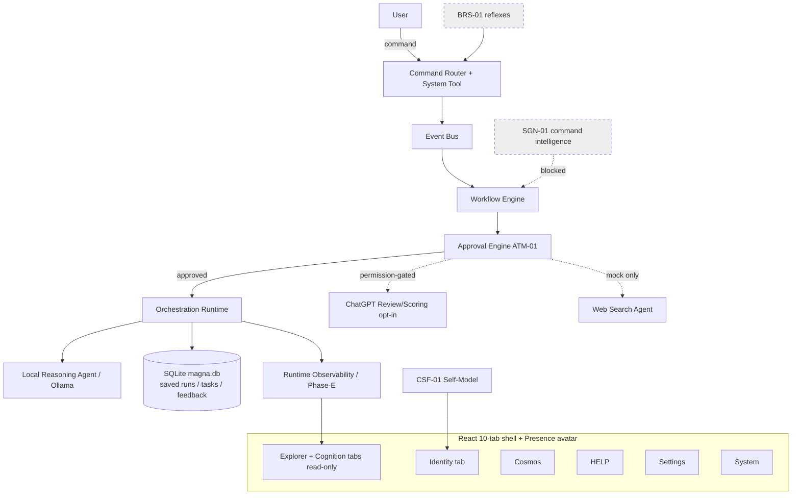
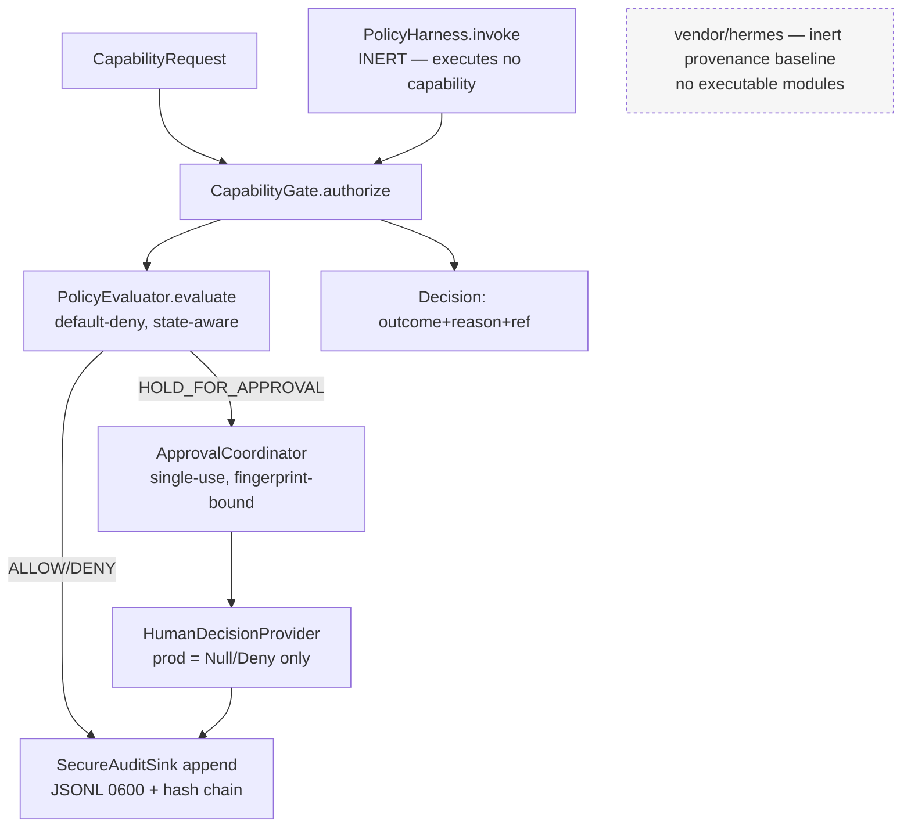

# 04 — Current (Implemented) Architecture

> What is **actually present in code today**, separated from documented/target intent.
> Mermaid diagrams mark planned components distinctly.

## 1. magna-command-center — current implemented architecture

**Shape (evidenced by directory + test inventory):** local-first single-user runtime,
React+TS+Vite frontend, FastAPI backend, SQLite persistence.

- **Frontend** (`src/`, root Vite package): 10-tab shell (Command, Identity, Agents,
  Memory, Explorer, Cognition, Cosmos, Help, Settings, System); Tailwind 4; Framer
  Motion 12; Three.js 0.184 ("Magna Presence" avatar). Product name config-driven
  (`frontend/src/config/app.config.json`, per Blueprint §4). Zustand state.
- **Backend** (`backend/app/`, 204 `.py`): packages `core`, `domains`, `orchestrator`,
  `providers`, `agents`, `services`, `api`, `models`, `schemas`, `db`.
- **Runtime primitives** (evidenced by `backend/tests/test_core_*`): event bus,
  workflow engine, approval engine, orchestration runtime, websocket dispatcher,
  audit logger, risk classifier, attention, agent protocol, runtime observability,
  consolidation, plus "durable runtime linkage" (durable authority, restart
  rehydration, cache demotion — Blueprint §4 + `validate-durable-runtime-linkage` branch).
- **Persistence:** `data/magna.db` + `backend/data/magna.db` (SQLite). `docs/DATABASE_SCHEMA.md`.
- **Agents:** Orchestrator, Local Reasoning (Ollama), ChatGPT Reviewer, ChatGPT Scoring,
  Memory, Voice (push-to-talk), UI Workflow, Web-Search (**mock/stub only**).
- **Governance code:** ATM-01 boundary rules (`test_atm_01_boundary_rules`), bounded
  approvals (`test_domains_bounded_approvals`), authorization boundary/UX, risk policy
  engine (`test_risk_policy_engine`), CSF-01 conscious self-model.



**Architecture rule (Blueprint §4):** runtime authority belongs to governed backend
APIs + durable state, not UI/worker inference. HELIX observes/visualizes; does not mutate.

## 2. magna-enso — current implemented architecture

**Almost none.** The only runtime code present is the **uncommitted Sprint-5 policy
engine** (`policy/`, 883 LOC). Everything else is governance docs + an inert Hermes
baseline.



Key implemented properties (from `policy/gate.py`, `policy/README.md`):
- **Fail-closed:** any exception, missing policy, missing provider, or audit failure →
  `DENY`. Production providers can only deny (no approve-returning provider ships).
- **Default-deny + HOLD_FOR_APPROVAL** with single-use, SHA-256-fingerprint-bound
  approvals (binds approval id, nonce, capability, path, params, resources, caller,
  policy hash, expiry).
- **Append-only audit** JSONL (`0600`, fsynced, hash-chained — corruption-detecting,
  not tamper-proof).
- **Inert harness:** `PolicyHarness.invoke` returns decisions and **executes nothing**.

⚠️ This code is **untracked**, its **tests cannot run** (C-7), and governance docs say
it doesn't exist (C-6). Treat as *PARTIALLY IMPLEMENTED, NOT VERIFIED*.

## 3. TRACE — current implemented architecture

```mermaid
flowchart LR
  CC[Claude Code session] -->|PreToolUse/PostToolUse/Stop hooks| HOOK[trace_hook.py]
  HOOK -->|POST 127.0.0.1:8000| API[FastAPI ingest]
  HOOK -->|JSONL write-ahead| WAL[(local JSONL fallback)]
  API --> DB[(SQLite telemetry)]
  DB -->|SSE| UI[React dashboard:5173<br/>timeline, durations, context-rot gauge, evidence browser]
  EVID[review-packages/ in GitHub] --> UI
  classDef planned stroke-dasharray:5 5;
  OTEL[OpenTelemetry token/cost]:::planned -.v1.1.-> DB
  SUB[Real subagents per-agent telemetry]:::planned -.v2.-> DB
```

Real today: template/roles/hooks, FastAPI+SQLite+SSE server, React dashboard, evidence
browser, approximate-ROI panel, `npm run init` wizard. Planned: OTel (v1.1), real
subagents + cross-session analytics + team telemetry (v2). Roles are **advisory**, not
runtime-enforced (only universal safety deny-rules in `.claude/settings.json`).

## 4. Magna ↔ HELIX ↔ TRACE relationship (current)

- **magna-command-center** *embodies* HELIX (canon in `project-knowledge/`) and Magna
  in one repo; it has its **own** internal task-orchestration/traceability model
  (`MAGNA_TASK_ORCHESTRATION_AND_TRACEABILITY_ARCHITECTURE.md`, `prepare_task`/`close_task`),
  which is **not** TRACE-the-methodology.
- **magna-enso** *consumes* TRACE as its engineering operating model and *references*
  HELIX as DNA without importing it.
- **TRACE** is independent and could observe either, but **no wiring exists** between
  the TRACE dashboard and either Magna codebase today.
