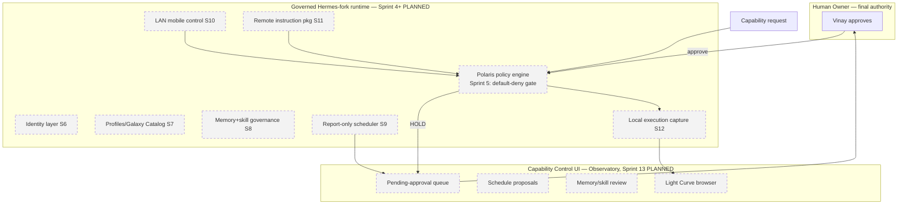
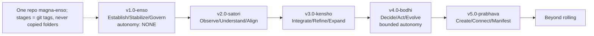
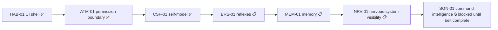

# 05 — Target & Evolution Architecture

> Documented/target intent. **Planned components are marked; none of this is implemented
> unless `04_CURRENT_ARCHITECTURE.md` says so.**

## 1. Target Magna Enso architecture (per charter + sprint plan, all PLANNED)

Every capability passes the policy gate; nothing executes without a human approval;
every action emits a Light Curve. **All boxes above are PLANNED**; only the policy gate
exists in code (uncommitted, unverified).

## 2. Evolution architecture — stages as one repo (frozen EH-0003)

| Stage | Adds | TRACE affinity | Autonomy |
|---|---|---|---|
| Enso | governance floor, policy engine, identity, capture, Control UI | v1 Core → Govern (L1–L3) | none by default |
| Satori | self-observation telemetry, alignment checks, assisted suggestions | v2 Assist (L3) | observe-and-suggest |
| Kensho | deep self-model, capability self-assessment, evidence scoring | v2→v3 (L3–L4) | governed self-tuning |
| Bodhi | governed decision-making, bounded autonomous action in policy envelopes | v3 Govern (L4–L5) | bounded autonomy |
| Prabhava | generative capability composition, cross-domain connection | v3 advanced (L5) | high within governance |
| Beyond | continuous self-evolution | post-v3 (L5+) | continuous |

**Guardrail (roadmap §7):** awareness/autonomy is sequenced *after* a proven governance
foundation — "you cannot safely give a system awareness or autonomy until you can
govern, bound, and reverse every capability it has."

## 3. Target magna-command-center architecture (Pre-SGN belt → SGN-01)

Agile framing (Blueprint §10): Release 1 = Belt Complete + SGN-01 v1, sequenced
S0 (de-risk: reconcile roadmaps, fix status drift, add quality gates) → S1 BRS-01 →
S2–S3 MEM-01/NRV-01 → S4–S6 SGN-01 design → v1. Recommended tooling: ruff, pyright,
pytest-cov, pre-commit, Alembic, structlog.

## 4. TRACE target architecture

v1.1: OpenTelemetry exporter (accurate session token/cost). v2: real subagents with
per-agent token telemetry; cross-session + baseline-vs-TRACE analytics; team/multi-user
hosted dashboard. TRACE v1→v2→v3 maps to Core → Assist → Govern (blueprint §35–37).

## 5. ⚠️ The two evolution models are NOT reconciled

The Pre-SGN belt (HAB/ATM/CSF/BRS/MEM/NRV/SGN) and the Enso→Beyond stages are **separate
metaphors in separate codebases** with **no mapping document** between them. A target
architecture for "the clean Magna project" cannot be finalized until decision #3
(program identity) and a reconciliation are made. See `16` and `17`.

## 6. Data & event flow, request-to-action (target, Enso)

`request → policy gate (evaluate) → [ALLOW → execute+capture → Light Curve] |
[HOLD → human approval queue → approve → execute+capture → Light Curve] | [DENY → log]`.
No path bypasses the gate (sprint plan §S5 acceptance: "no path bypasses the gate").
This is the *designed* contract; only the gate's decision half exists in code; the
*execute/capture* half (Sprint 12) is unbuilt.
