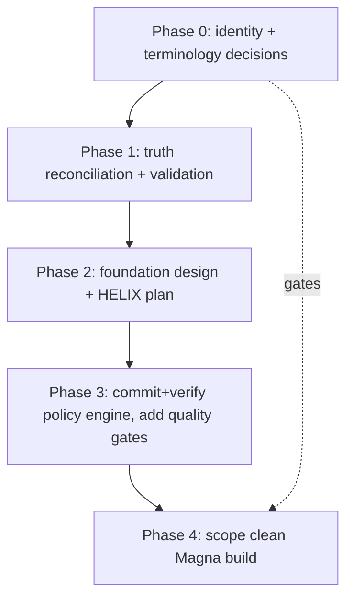

# 17 — Recommended Foundation Sequence

> Sequenced, read-only-first plan to reach a clean, professionally-designed Magna
> project. **No implementation, no new repo, no Hermes fork, no sprint start** until the
> gating decisions land. This is a recommendation, not an authorization.

## Phase 0 — Decide identity & terminology (BLOCKS ALL) 
Resolve **D-1, D-2, D-3, D-4** from `16`. Until program identity (D-3) is fixed, nothing
downstream is safe to design. Record each as an Event Horizon decision.
**Exit:** Kensho/Kenosha set; repo model set; "which Magna" set; HELIX-as-repo set.

## Phase 1 — Truth reconciliation (no new features)
1. Fix Enso status drift: reconcile README/TRACE_CONFIG with STAR_MAP (**C-5**); decide
   and record Sprint-5 status (**D-5/C-6**).
2. Authorize and run **read-only validation** (**D-6**) to convert claimed → verified for
   command-center (498-passed claim, **C-10**) and to document the Enso test-collision
   (**C-7**) precisely.
3. Reconcile the **two evolution models** (Pre-SGN belt ↔ Enso stages) and the **two
   command-center roadmaps** into ONE canonical spine.
**Exit:** every status doc matches its working tree + test reality; one evolution narrative.

## Phase 2 — Foundation design for the clean build
4. Choose canonical **policy engine**, **traceability spine**, and **runtime audit/replay
   surface** (**D-8**). Write the target architecture (merging `04`+`05`).
5. Decide HELIX extraction plan (**D-4**): what governance canon moves into `magna-helix`.
6. Define **entry/exit criteria** for Satori→Beyond (currently missing — `14` gap) so the
   roadmap is more than themes.
**Exit:** a single, signed target-architecture + governance baseline.

## Phase 3 — Make the existing valuable code real (before building new)
7. If keeping Enso `policy/`: **commit it, fix the `tests/policy` ↔ `policy` collision**
   (add `conftest.py`/`pyproject.toml` with `pythonpath`/`rootdir`), get the suite green,
   then put it through normal Sprint-5 acceptance with a real Light Curve.
8. Add minimal quality gates the docs already recommend (ruff, pyright/mypy, pytest-cov,
   pre-commit) to whichever repo is canonical.
**Exit:** the first runtime feature is committed, tested-green, and human-accepted —
the first *real* validation that TRACE governs delivery, not just planning.

## Phase 4 — Only now: scope the clean Magna project
9. With identity, architecture, and a proven first feature in hand, scope the clean repo
   (or the continued repo) and its first sprints. Hermes stays inert until the policy
   engine is verified (R-06 closed).

## Critical-path diagram

## What NOT to do next (guardrails)
- Do **not** create the new "clean Magna" repository yet (needs D-3).
- Do **not** fork/activate Hermes (needs verified policy engine; R-06 OPEN).
- Do **not** accept Sprint 5 until C-6/C-7 are resolved with real green evidence.
- Do **not** merge the two evolution models silently — record the reconciliation as a
  decision.

## Recommended next review worker
A **validation/verification worker** (Codex builder in *investigation/validation* mode,
or Antigravity for safety) to execute Phase 1 step 2 (read-only test runs) and produce a
verified-state report — turning this discovery's "claimed" rows into "verified" rows
before any design or build begins.
