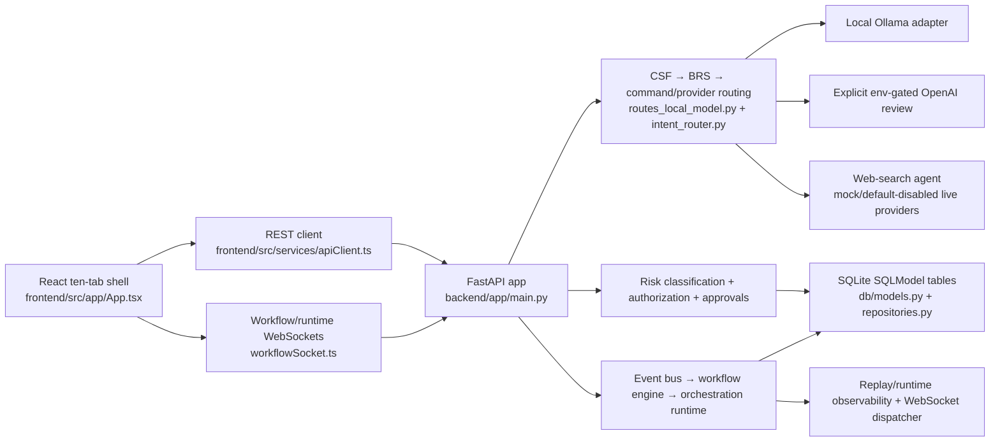

# Current Source Architecture Verification

## Verified current architecture

## Source evidence

- Routes and shell: `frontend/src/app/App.tsx`; `frontend/src/utils/navigationRoutes.ts` define Command, Identity, Agents, Memory, Explorer, Cognition, Cosmos, Help, Settings, System.
- Communication: `frontend/src/services/apiClient.ts` performs real fetches and constructs `/ws/workflow/{taskId}` and `/ws/events`; service modules bind UI panels to backend endpoints.
- FastAPI: `backend/app/main.py` registers health, model/review, provider, policy, authorization, approval, sessions/tasks, agent, system, WebSocket, explorer, and observability routers.
- Runtime: `backend/app/core/event_bus.py`, `workflow_engine.py`, `orchestration_runtime.py`, `approval_engine.py`, `runtime_initializer.py`, `runtime_observability.py`, `websocket_dispatcher.py` contain executable classes and durable reads/writes.
- Persistence: `backend/app/db/models.py`, `database.py`, `repositories.py`; default URL in `core/config.py` is SQLite.
- Provider integrations: `services/ollama_service.py` makes local HTTP calls; `services/cloud_review_service.py` gates OpenAI behind explicit configuration; web search is permission-aware and defaults to mock; voice uses browser recognition/synthesis hooks and bounded backend domain scaffolding.
- Traceability: `scripts/magna_prepare_task.py`, `scripts/magna_close_task.py`, `agent-logs/_traceability/task_sessions.jsonl`, and `project-knowledge/MAGNA_TASK_ORCHESTRATION_AND_TRACEABILITY_ARCHITECTURE.md` implement/describe engineering task preparation and closure separately from runtime event lineage.

## Planned or not verified as operational

Ambient voice/wake word, unrestricted runner/device control, autonomous orchestration, first-class working memory, public deployment, multi-user operation, and TRACE-to-Magna runtime interoperability are deferred. Presence is implemented as UI projection; it is not evidence of autonomous cognition. Production/UAT/DR operation was not found.

