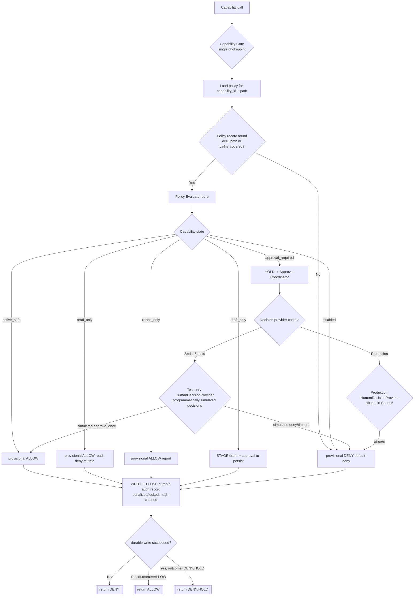
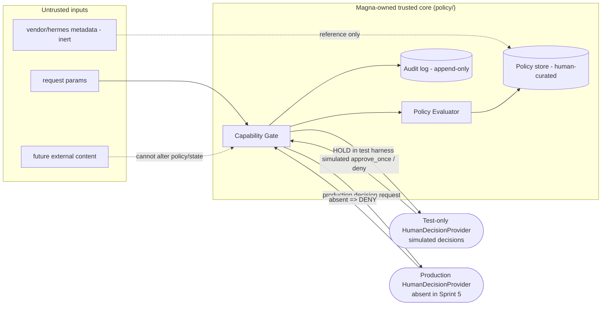

# ENFORCEMENT_ARCHITECTURE.md
# Magna Enso — Sprint 5 Enforcement Architecture
# Type: Local-only approval package (design proposal; no code)
# Date: 2026-06-20
# Status: FOR HUMAN APPROVAL. Sprint 5 NOT started. No runtime enforcement exists yet.

---

## 1. Purpose

Propose the architecture of the policy engine (Polaris) so the human owner can approve the *shape* before any
code. Traces to Sprint 3 `DEFAULT_DENY_MODEL.md`, `UNIFIED_APPROVAL_ENGINE_MODEL.md`, `POLICY_CHOKEPOINT_MAP.md`,
`CAPABILITY_POLICY_SCHEMA.md`, `CAPABILITY_STATES_PROPOSAL.md`.

## 2. Components (Magna-owned, all new in `policy/`)

| Component | Responsibility |
|---|---|
| **Policy store/loader** | Load + validate capability-policy records. **Runtime records are JSON** (stdlib `json`); read-only at evaluation time. YAML is reference metadata only (D-3/D-4). |
| **Capability gate (chokepoint)** | The single entry every capability call passes through. Calls the evaluator; enforces the outcome. **Deny-only until the audit sink is available + validated** (see ordering, §2a). |
| **Policy evaluator** | Pure decision function: `(request, policy, context) → decision`. No side effects. |
| **Approval coordinator** | For `approval_required`/draft persistence: builds an approval request, blocks, asks the `HumanDecisionProvider`, and on consumption recomputes + compares the **complete canonical invocation fingerprint** (SHA-256 over canonical JSON; HUMAN_AUTHORITY §4a) inside the serialized critical section. Any field mismatch/mutation/duplicate/expiry/replay ⇒ DENY. |
| **`HumanDecisionProvider` (contract) + Null/Deny provider** | The boundary across which a human decision arrives (D-7). `policy/` contains **only** the contract + a **fail-closed Null/Deny provider** (always DENY, the default). The simulated approve/deny provider exists **only under `tests/policy/`**; **production never imports from `tests/`**. Isolation is **structural (package layout), not a `TESTING` flag and not an "uncatchable exception"** (HUMAN_AUTHORITY §2b). Missing/unrecognized provider ⇒ **DENY**. |
| **Audit/evidence log (sink)** | Append-only JSONL: **secure file (`0600`, owner/regular-file/symlink-checked, verified at startup + before use; `FAILURE_MODES` §3d)**, **serialized/locked** atomic append + flush, hash-chain head update, corruption detection, malformed-tail recovery, single-use **fingerprint-checked** approval consumption (D-8; `FAILURE_MODES` §3c). Sensitive values **redacted/hashed** (verification preserved). **Integrity-detecting, NOT tamper-proof** (a local admin can edit the file). Built **before** any ALLOW; insecure-file / lock / serialization failure ⇒ DENY. |
| **Gate interface / test harness** | Magna-owned surface that *represents* a capability call (no real runtime yet — see D-1). |

## 2a. Build/ordering invariant (audit before allow)

The **audit sink and its failure behavior are built and validated before the gate can emit any `ALLOW`**.
Until logging is available and proven, the gate is **deny-only**. An action that cannot be logged is denied
(fail-closed). This ordering is mandated in `IMPLEMENTATION_SEQUENCE.md` (S5.5 precedes any allow path).

## 3. Source of policy authority

- **Policy records** are the authority — Magna-owned, human-curated, version-controlled in `policy/`.
- **Default-deny** is the root rule: no record (or no path coverage) ⇒ DENY (`DEFAULT_DENY_MODEL` rules 1, 7).
- **No external input** (request payload, fetched content, vendor metadata) may change policy or capability
  state at evaluation time (`DEFAULT_DENY_MODEL` rule 4; anti-injection, R-07).
- Policy changes that loosen posture require explicit human action + an Event Horizon entry (no self-promotion).

## 4. Evaluation inputs and outputs

**Inputs:** `capability_id`, invocation path, request parameters, caller/role context, the matched policy
record (state, `paths_covered`, `approval_required`, `reversible`, risk).
**Output (decision):** one of `ALLOW` · `ALLOW_READ_ONLY` · `ALLOW_REPORT_ONLY` · `STAGE_DRAFT` ·
`HOLD_FOR_APPROVAL` · `DENY`, plus a structured audit record. The evaluator is **pure** (deterministic, no
side effects); enforcement and logging happen around it.

## 5. Enforcement flow

**An ALLOW is returned only after its audit record is durably written and flushed** (serialized/locked,
hash-chained — §2a, `FAILURE_MODES` §3a/§3b/§3c). If the durable write fails, the gate returns **DENY**
(fail-closed). DENY and HOLD are normal, expected behaviour — not errors.

## 6. Trust boundary

Sprint 5 trust is limited to human-curated policy plus a test-only provider producing programmatically
simulated decisions. The human-only rule is a future production invariant. No authenticated production
provider exists; its absence resolves to DENY. Untrusted inputs can request, never grant.

## 7. Separation: metadata vs. runtime enforcement

- `vendor/hermes/RETAINED_SURFACE_STATES.yaml` is **metadata** (intended states); it is **not** the enforcer.
  It is also **reference-only YAML** — runtime policy records that the engine reads are **JSON** (D-3).
- Sprint 5 builds the **enforcer** (engine + gate) as Magna-owned code, consuming JSON policy records derived
  from that metadata. The engine, not the YAML, makes decisions.
- **Harness-level only:** the engine is proven against the Magna-owned test harness. This does **not** prove
  that future *real* capability entry points cannot bypass the gate. **End-to-end chokepoint validation must
  recur whenever a real capability is integrated** (D-5); **R-06 stays OPEN**.
- Until Antigravity validates + the human accepts, the engine is "implemented but not authoritative." It must
  not be described as "runtime enforcement exists," "no bypass," "human authenticated," "tamper-proof," or
  "runtime protected." (`POLICY_ENFORCEMENT_PRECONDITION_CHECKLIST` honesty rule.)

## 8. Boundary between Magna Enso and Hermes

The engine is 100% Magna-owned. It does **not** import, call, run, or build any Hermes module. The inert
`vendor/hermes/` baseline is reference metadata only and stays inert (EH-0015). No executable Hermes source
enters in Sprint 5.

## 9. Open architecture decisions

D-1 (harness scope), D-2 (approval persistence/replay), **D-3 (JSON runtime policy records; YAML
reference-only; PyYAML = proposed dependency if YAML runtime)**, D-4 (stdlib-only), D-5 (R-06 stays OPEN +
recurring end-to-end validation), D-6 (workers), **D-7 (`HumanDecisionProvider`: test-only provider;
absent ⇒ DENY; no authenticated provider)**, **D-8 (audit durability: append-only+integrity, not
tamper-proof)** — see `RISKS_OPEN_QUESTIONS_AND_DECISIONS.md`. Human decisions to confirm before execution.
**PRQ-1 is CLEARED** by `4d5c203cc236be84bd4b9bd8004cb88e8797a34d`; D-1 through D-8 remain pending.
