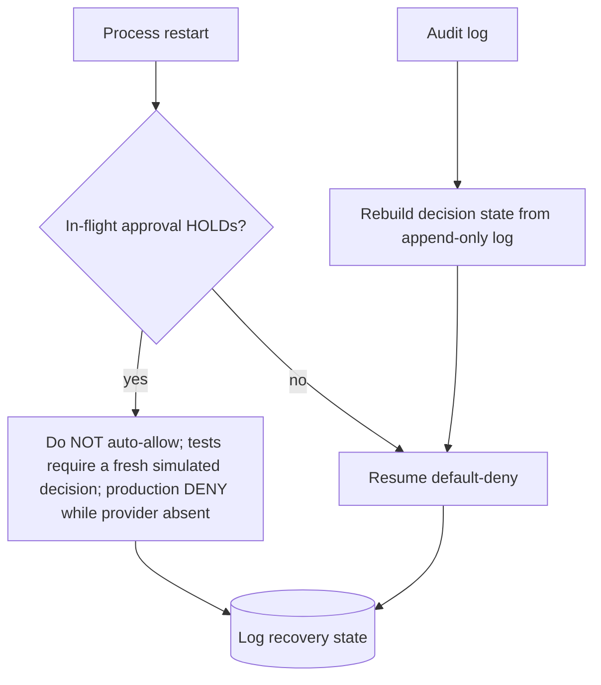

# FAILURE_MODES_AND_FAIL_CLOSED_BEHAVIOR.md
# Magna Enso — Sprint 5 Failure Modes and Fail-Closed Behavior
# Type: Local-only approval package
# Date: 2026-06-20
# Status: FOR HUMAN APPROVAL. Sprint 5 NOT started.

---

## 1. Principle

> **When in doubt, deny.** Any failure, ambiguity, or unavailable dependency resolves to **DENY**. The gate
> fails *closed*, never open. (Sprint 3 `DEFAULT_DENY_MODEL.md`: fail-closed; unknown ⇒ deny.)

## 2. Failure-mode matrix

| ID | Failure | Fail-closed behavior | Logged? |
|---|---|---|---|
| F-1 | No policy record for capability | DENY (default-deny) | yes |
| F-2 | Policy store missing/unreadable/corrupt | DENY all; surface a hard error to human | yes |
| F-3 | Policy record malformed / fails schema validation | DENY for that capability; do not "best-effort" allow | yes |
| F-4 | Evaluator exception / timeout | DENY the call | yes |
| F-5 | Audit log unwritable / sink unavailable | DENY (no action without an audit trail); gate is deny-only until the sink is available + validated | attempt + error surfaced |
| F-5a | Audit append not durable (no flush) before action | DENY until append is flushed; ALLOW only after the record is durably written | yes |
| F-5b | Malformed tail (crash mid-append) | On recovery, truncate/quarantine the malformed tail; resting state default-deny | recovery event logged |
| F-5c | Corruption detected (hash-chain break) | DENY new ALLOWs; surface a hard error to the human | yes |
| F-6 | Production `HumanDecisionProvider` unavailable / unconfigured / absent (D-7) | `approval_required` ⇒ DENY. Sprint 5 has only a test provider producing programmatically simulated decisions; no authenticated production decision can be obtained. | yes |
| F-7 | Decision-provider timeout / no response | DENY (no silent allow); production provider is absent | yes |
| F-8 | Path not in `paths_covered` | DENY + flag uncovered path | yes |
| F-9 | Concurrent/duplicate request | single-use decision; duplicates DENY | yes |
| F-10 | Process restart mid-decision | in-flight HOLDs do not auto-resolve to allow on restart; pending approvals are NOT carried across restart (§3aa) | yes |
| F-11 | Clock/expiry uncertainty or rollback | invalidate pending approvals ⇒ DENY (§3aa) | yes |
| F-12 | Audit file insecure permissions (not owner-only) | initialization failure ⇒ gate DENY-all (§3d) | attempt + error |
| F-13 | Audit path is a symlink / non-regular file | refuse ⇒ initialization failure ⇒ gate DENY-all (§3d) | attempt + error |
| F-14 | Audit file owned by another user | owner-verification fails ⇒ initialization failure ⇒ DENY-all (§3d) | attempt + error |
| F-15 | Cannot create file with restrictive perms atomically | creation fails closed (no permissive intermediate) ⇒ DENY-all (§3d) | attempt + error |
| F-16 | Approval fingerprint mismatch / missing field / mutation | DENY (consumption check, §3c; binding §4a of HUMAN_AUTHORITY) | yes |

## 3. Behavior on restart / replay

- The append-only audit log is the **recovery source of truth**; decisions are reconstructed from it.
- A pending HOLD never becomes an ALLOW across a restart. Tests require a fresh programmatically simulated
  decision; production returns DENY while the production provider is absent (defends T-8/T-9).
- Default-deny is the resting state after any restart.

## 3aa. Clock handling (Antigravity Gap 4 / T-9 / F-11)

- **Expiry within a running process uses monotonic time** (`time.monotonic`), not wall-clock — wall-clock can
  jump or be set backward.
- **Pending approvals are NOT carried across a restart.** A restart resets the monotonic reference, so any
  pending approval/HOLD is invalidated and must be requested fresh (default-deny resting state). Do **not**
  imply that monotonic timestamps survive a process restart — they do not.
- **Wall-clock timestamps may be retained in the audit record** for human-readable evidence only — they are
  evidence, **not** the authority for expiry.
- **Clock rollback or uncertainty invalidates pending approvals and DENIES.** If monotonic/elapsed reasoning
  is unavailable or inconsistent, treat the approval as expired ⇒ DENY.

## 3a. Audit durability model (D-8) — append-only ≠ tamper-proof

The audit sink is **append-only by intent with integrity detection**, not a tamper-proof store. Sprint 5 design:

| Property | Behavior |
|---|---|
| Atomic append | Each record written as one atomic append (e.g. single `write` of a framed JSONL line). |
| Flush / durability | `flush` + `fsync` (or equivalent) before the corresponding action is permitted to proceed. |
| Malformed-tail recovery | A partial trailing record from a crash is detected and truncated/quarantined on startup. |
| Corruption detection | Records are hash-chained; a broken chain is detected and blocks new ALLOWs (F-5c). |
| Replay validation | The log is the recovery source of truth; decisions/approvals are reconstructed from it. |
| Approval consumption | Each approval is marked consumed exactly once; consumed/expired ⇒ cannot be reused. |
| Duplicate handling | Duplicate request/decision records are detected and collapsed; no double-allow. |

**What Sprint 5 does NOT protect against (stated honestly):**

- A **local administrator (or anyone with filesystem write access) editing or deleting audit files.** The log
  is integrity-*detecting* (you can tell it was altered), **not** tamper-*proof* (you cannot prevent it).
- A signed / append-only-enforced / external tamper-evident store is **future work** (separate decision).
- Therefore the package must not claim the audit trail is "tamper-proof" or "immutable."

## 3b. Ordering invariant — audit sink before any ALLOW (Correction 6)

The gate **cannot emit an `ALLOW` until the audit sink exists and its failure behavior is validated.** Until
then the gate is **deny-only**. Concretely: build/validate the sink (and F-5/F-5a/F-5b/F-5c handling) **before**
wiring any allow path (`IMPLEMENTATION_SEQUENCE.md` S5.5 precedes the allow-capable gate at S5.4→S5.6).

## 3c. Serialization / locking requirement (Correction 7)

Concurrency must not create a window where two requests both "win." Sprint 5 requires **explicit
serialization or locking** around every shared-state mutation, and **any lock/serialization failure ⇒ DENY**:

| Shared-state operation | Requirement |
|---|---|
| Concurrent JSONL audit appends | Serialized (single-writer lock or atomic append under a lock) — no interleaved/partial records |
| Hash-chain head update | Atomic read-modify-write under the same lock as the append (chain head and record committed together) |
| Approval consumption | Inside the lock: recompute + compare the **complete canonical invocation fingerprint** (HUMAN_AUTHORITY §4a), then mark consumed **atomically and single-use** — two concurrent consumers cannot both succeed; any field mismatch ⇒ DENY |
| Duplicate / replay prevention | Duplicate detection + fingerprint check + consumption happen **inside** the critical section, before any ALLOW is returned |

Rules:
- The audit append (with flush) and its chain-head update happen **before** the corresponding ALLOW is
  returned (§3b ordering), **inside** the serialized section.
- If the lock cannot be acquired, the writer fails, or serialization is otherwise unavailable ⇒ **DENY**
  (fail-closed). No "optimistic allow" on contention.
- This is local, single-process/single-host serialization (consistent with local-first MVP). Distributed
  locking is out of scope and a future decision.

## 3d. Audit-file security (Antigravity Gap 3 / T-10 / D-8)

The audit file's value depends on its filesystem security. Sprint 5 requires, at initialization **and before
each use**:

| Property | Requirement |
|---|---|
| Owner-only permissions | Create/maintain mode **`0600`** (owner read/write only); reject more-permissive modes |
| Restrictive creation | Create atomically with restrictive perms (e.g. `O_CREAT|O_EXCL` + mode, or `os.open` with `0o600`) — **no permissive intermediate state** then chmod-down |
| Owner verification | File owner UID must equal the process owner; else fail |
| Regular-file verification | Must be a regular file (not FIFO/device/dir) |
| Symlink refusal | Refuse if the path (or a parent component, as feasible) is a symlink (`O_NOFOLLOW` where available) |
| Verify at startup **and before use** | Re-check perms/owner/type before each append, not only at boot |

**Failure to establish or verify any property ⇒ initialization failure ⇒ the gate DENIES all capability
requests** (no audit ⇒ no ALLOW). 

**Platform-specific handling (documented, not silently weakened):** POSIX uses `0600` + `os.stat` ownership +
`O_NOFOLLOW`/`O_EXCL`. On platforms without full POSIX semantics (e.g. Windows ACLs), apply the closest
owner-only ACL equivalent and **document the gap explicitly**; if the secure property cannot be established,
**fail closed (DENY)** rather than proceed with weaker security.

## 4. What fail-closed must never become

- Never "allow because the policy store was empty."
- Never "allow because logging was unavailable."
- Never "allow because approval timed out."
- Never "allow because the evaluator errored."
These are the classic fail-open mistakes; Sprint 5 tests must assert DENY for each (see
`TEST_AND_VALIDATION_PLAN.md`).

## 5. Honesty boundary

Fail-closed behavior is a **requirement** for the engine, demonstrated against the test harness. It is not a
claim that a live system is currently protected — no real capability runtime exists yet.

## 6. Boundaries

Design only. No engine exists; these are acceptance requirements for the separately-approved implementation.
