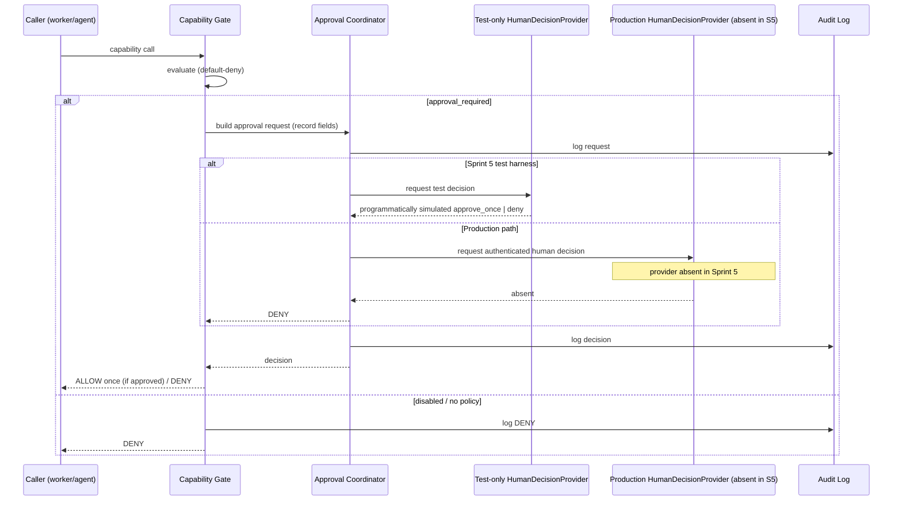

# HUMAN_AUTHORITY_AND_APPROVAL_BOUNDARIES.md
# Magna Enso — Sprint 5 Human Authority and Approval Boundaries
# Type: Local-only approval package
# Date: 2026-06-20
# Status: FOR HUMAN APPROVAL. Sprint 5 NOT started.

---

## 1. Purpose

Define the test and future production decision boundaries for the approval-request flow (`ENSO-F-0502`).
Sprint 5 uses programmatically simulated decisions in tests; the human-owner-only rule is a future production
invariant. Traces to `trace/TRACE_CONFIG.yaml` `human_authority`, EH-0010, and Sprint 3
`UNIFIED_APPROVAL_ENGINE_MODEL.md`.

## 2. The authority rule

> **Future production invariant:** only the authenticated human owner (Vinay) may turn a
> `HOLD_FOR_APPROVAL` into an `ALLOW`. Sprint 5 does not implement that authenticated production boundary;
> it exercises the contract with programmatically simulated test decisions only.

## 2a. The human-decision boundary — `HumanDecisionProvider` (D-7)

Sprint 5 introduces a **`HumanDecisionProvider`** contract (interface): the single boundary across which a
human decision (`approve_once` / `deny`) enters the engine. Important honesty constraints:

- **Sprint 5 test approval is programmatically simulated by a test-only provider.** It is **not** authenticated
  human approval. Sprint 5 does **not** build identity, authentication, or a real approval UI/channel.
- The test-only provider *simulates* approve/deny decisions for the test harness only.
- **No production/authenticated human-approval provider exists in Sprint 5.**
- **A missing, unconfigured, or default (i.e. absent production) provider resolves to `DENY`** (fail-closed).
  The engine never treats "no provider" as "allow."
- Therefore Sprint 5 must **not claim that authenticated human approval exists**. It claims only: "there is a
  contract where a human decision *would* arrive, exercised in Sprint 5 by a programmatically-simulated
  test-only stub; production human authentication is a later, separately-approved sprint."
- A real `HumanDecisionProvider` (authenticated, surfaced in the Capability Control UI, Sprint 13) is future
  work and a separate decision.

## 2b. Test-provider isolation — **structural, not flag-based** (Antigravity Gap 1 / T-4 / D-7)

The isolation boundary is **structural (package layout)**, NOT an environment/config flag.

> **Explicitly rejected:** Do **not** use `TESTING=True` (or any env/config flag) as an authority boundary,
> and do **not** rely on an "uncatchable exception" — Python provides no such guarantee (any exception can be
> caught). A flag can be set in production; an exception can be swallowed. Neither is a trustworthy boundary.

**Required structural design:**

- `policy/` (production code) contains **only**: the `HumanDecisionProvider` **contract/interface** and a
  **fail-closed Null/Deny provider** (its `decide()` always returns `DENY`). This Null/Deny provider is the
  **default** when no provider is configured.
- The **simulated (approve/deny) provider exists only under `tests/policy/`** — never under `policy/`.
- **Production code must never import from `tests/`.** (Tests import production code, never the reverse.)
- **No simulated provider is packaged, registered, discovered, or default-wired by production code.**
- **Missing, unconfigured, unrecognized, or unresolved provider ⇒ `DENY`** (the Null/Deny provider).
- A **structural test** asserts that no test/simulated-provider implementation exists anywhere under
  `policy/` (e.g. grep/AST check: no approve-returning provider in production code; `tests/` not importable
  from `policy/`).
- Sprint 5 still **does not claim authenticated human approval** — only a test-fixture stub simulates it.

## 3. Approval flow

## 4. Approval record fields (from Sprint 3 design)

`approval_id`, `requester`, `capability_id`, `proposed_action`, `risk_level`, `affected_resources`,
`expected_side_effects`, `rollback_possibility`, `expiration`, `human_decision`, `audit_log_reference`.
Every request carries all of these; every decision is logged.

## 4a. Exact approval binding — canonical invocation fingerprint (Antigravity Gap 2 / T-9)

An approval must be bound to the **exact** invocation it authorized, so a token granted for a safe action
(`ls`) can never be replayed for an unsafe one (`rm -rf /`). Sprint 5 defines a **canonical invocation
fingerprint** containing **at minimum**:

| Field | Purpose |
|---|---|
| `approval_id` + `nonce` | unique per request; single-use; unguessable |
| `capability_id` | which capability |
| `invocation_path` | which path reached the gate |
| `proposed_action` | the exact action |
| `parameters` (normalized, **complete**) | every argument, fully normalized (order/whitespace/encoding) |
| `affected_resources` | exact resources/paths/targets |
| `caller_context_id` | caller/context identity |
| `policy_version` / `policy_record_hash` | which policy authorized it |
| `expiry` | monotonic-based expiry (see Clock handling, `FAILURE_MODES` §3aa) |

**Computation:** deterministic **canonical JSON** (sorted keys, fixed separators, normalized encoding) hashed
with **SHA-256** (stdlib `hashlib`/`json` — no new dependency). The fingerprint is computed for the request
and recomputed for the consuming invocation.

**Consumption rule:** approval consumption compares the **complete fingerprint inside the same serialized
critical section** that marks the approval consumed (`FAILURE_MODES` §3c). **Any missing field, mismatch,
mutation, duplicate, expiry, or replay ⇒ `DENY`.** Comparison is whole-fingerprint (no partial / field-subset
match).

**Redaction:** sensitive values (secrets, full file contents, tokens) must **not** be exposed unnecessarily in
audit logs. Store the **fingerprint hash** (and per-field hashes where needed) rather than raw sensitive
values, so verification is preserved without leaking the payload. Redaction must not weaken the binding — the
hash is over the complete, unredacted canonical form.

## 5. Approval boundaries (binding)

1. **Future production human-only invariant:** production approval must be reachable solely through an
   authenticated human-owner provider. Sprint 5 has no such provider; its test-only provider emits
   programmatically simulated decisions only, and a missing production provider returns DENY (defends T-4).
2. **Per-action, scoped, fingerprint-bound:** an approval authorizes one specific invocation, matched by the
   **complete canonical invocation fingerprint** (§4a) — not a `capability_id`-only or blanket allow. Any
   field mismatch/mutation ⇒ DENY (defends T-9 argument-swap).
3. **Single-use + expiring:** approvals expire (monotonic-based) and cannot be replayed; consumption is
   serialized and single-use (defends T-9).
4. **Revocable:** a standing/queued approval can be revoked before use.
5. **Fail-closed:** no decision / timeout / engine error ⇒ DENY (defends T-7).
6. **Fully logged:** request and decision are recorded before the action proceeds (defends T-10).
7. **No self-approval:** workers (Codex/Claude/Antigravity/Grok) may *request* and *recommend*, never approve.
8. **Draft persistence is an approval:** `draft_only` memory/skill writes persist only on human acceptance
   (Sprint 8 consumes this; Sprint 5 provides the decision surface).

## 6. What Sprint 5 must NOT do to human authority

- Must not add an "auto-approve under condition X" path.
- Must not let config/env raise capability state past `approval_required`.
- Must not treat agent identity as approver authority.
- Must not claim authenticated human approval exists; Sprint 5 has only programmatically simulated decisions
  from a test-only provider.
- Must not treat a missing `HumanDecisionProvider` as anything but `DENY`.
- Must not commit/push (those are themselves human-gated actions, `TRACE_CONFIG.human_authority`).

## 7. Boundaries

Design only. The approval coordinator is implemented only after human approval of this package; until then no
approval surface exists.
